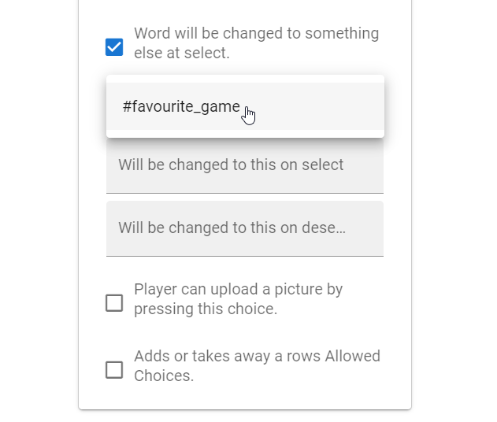
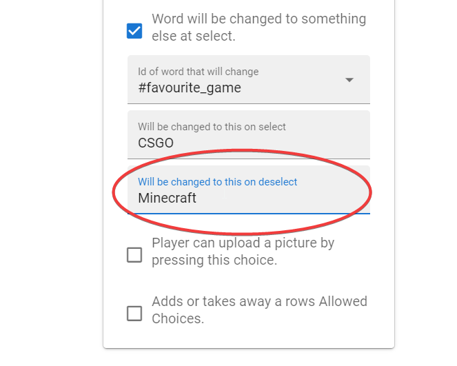
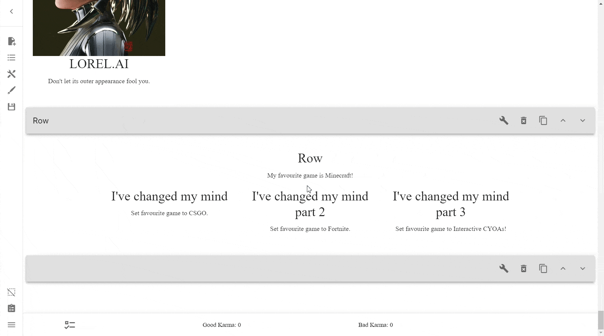

# Reference
This is the reference for Interactive CYOA creators. 

While the rest of the tutorial focuses on individual concepts within the
creator, this section focuses on real issues and desired outcomes, and walks
you through how to achieve it.

## Creator
### Zoom in and out
As the desktop application is an Electron app, it is functionally just a
website that runs in its own web browser. Because of this, you can zoom in
and out of the desktop app by doing ++ctrl+plus++ (++ctrl+shift+equal++) to 
zoom in, and ++ctrl+minus++ to zoom out.

!!! tip

    If you need to reset your zoom level and you're using the offline app,
    simply look at the top where it says **View**. Press that, and then
    **Actual Size**.

    Alternatively, press ++ctrl++ + ++0++.

## General

### Colours

Move the other colour stuff to this section.

#### (TODO) Find out the hex code of a colour

#### (TODO) Generate a colour palette

## Whole CYOA
### Changing the page title
In order to change the title of the tab in the browser, simply edit
`index.html`.

Look for:
```html
<title>CYOA</title>
```
and replace "CYOA" with whatever you want the title to be.

One title format is `{CYOA name}: Interactive`, but whatever works for you is
fine.

### Changing the page icon
Changing the icon of the page's tab is simple, all you need to do is add the
following code to your `index.html` file, just below the `<title>` tag:

```html
<link rel="icon" href="/link/to/icon.jpg">
```

### (TODO) Table of Contents / Tab Menu

### Show a loading progress indicator
See [here](../extending-your-cyoa/#progress-indicator).

### Make the Background completely static
A static background, as opposed to a continuous or overlapping background, is
one that scrolls with the user, perfect for backgrounds that do not repeat
perfectly.

An example of a continuous background is the
[Worm V3 Revised interactive][worm-v3] (shown below). No matter how far you
scroll, the background stays in the exact same position. 

It was first used in the
[Jedi - Guardian of the Republic Interactive CYOA][jedi-cyoa],
where the background fixes are attributed to
[u/LOLLOL12344](https://www.reddit.com/user/LOLLOL12344).


!!! warning

    It is likely your background will repeat behind Choice and Row backgrounds
    as well.
    
    In order to fix this, you have to go into each and every Row, turn on
    **Private Styling** → **Manage Background Design** → **Remove Photo**.

    Now, you have the default background colour in the background. You don't
    have to turn this off, but if you want to: **Private Styling** →
    **Manage Background Design** → Uncheck **Color of the row backgrounds**
    and/or **Color of the choice backgrounds**.

    It's probably a good idea to have a background on Choices, however.

#### CSS Method #1
This is the preferred method.

Download [static_background.css](/static/static_background.css), and put it
anywhere in your project's folder. I recommend putting it in a folder called
`css`, which should already exist if you have the Viewer.

Then, put this in your `index.html` in the `<head>` section:

```html
<link rel="stylesheet" href="./css/static_background.css">
```

Change the `href` to wherever you've put it.

#### CSS Method #2
If you don't want to rely on a folder, you can simply put it straight into your
`index.html` file in `<style>` tags. Put this in the `<head>` section:

```html
<style>
  .pb-12 {
    background-size: cover;
    background-position: center;
    background-attachment: fixed;
  }
</style>
```

#### JavaScript method
This is not the preferred method, but still works regardless.

In order to make a background static, if you don't have the
[progress indicator] simply add this code to the `<body>`
section of your `index.html`:

```html
<div id="indicator">
<script>
  {
    let _XHR = XMLHttpRequest;  XMLHttpRequest = class XHR extends _XHR {
      constructor () {
        super();
        this.addEventListener('progress', e => {indicator.innerText = " Loading data: " + (!e.total ? `${(e.loaded/1024**2).toFixed(1)} MB` : `${(100 * e.loaded / e.total).toFixed(2)}%`)});
        this.addEventListener('loadend', () => {indicator.innerText = "",document.getElementsByClassName("pb-12")[0].style.cssText += "background-size: cover;background-position: center;background-attachment: fixed;"});
      }
    }
  }
</script>
</div>
```

If you already have the [progress indicator], you can simply add this line
right after the `this.addEventListener('progress'…)` line:

```html
this.addEventListener('loadend', () => {indicator.innerText = "",document.getElementsByClassName("pb-12")[0].style.cssText += "background-size: cover;background-position: center;background-attachment: fixed;"});
```

---

This will modify your background to become static!

### Making the CYOA embed on sites
Wanted to know how to make your CYOAs have a little embed that shows
information when posted to sites such as Discord and Twitter?

You don't need to include all of these, they are all optional.

Simply paste this code in the `<head>` section of your `index.html`:

```html
<!-- Your username -->
<meta name="author" content="Your Name">
<!-- A description of your CYOA or site -->
<meta name="description" content="Your Description">
```

See more [here](https://www.w3schools.com/tags/tag_meta.asp).

### Make the CYOA show up on search engines
SEO—Search engine optimization—is the process of making your site look better
to search engines, so that it will appear higher in the search results.

I recommend giving *SEO* a Google search if you wanted to know more.

Simply paste this code in the `<head>` section of your `index.html`:

```html
<!-- Tags for search engines to pick up on -->
<meta name="keywords" content="CYOA, Interactive CYOA, Living God Interactive">
```

See more [here](https://www.w3schools.com/tags/tag_meta.asp).

### (TODO) Change the Scrollbar Colour
Add this to your `index.html` file, in the `<head>` section:


```html
<style>
    * {
        scrollbar-width: auto;
        scrollbar-color: rgba(251, 115, 52, 1) rgb(60, 75, 80);
    }
</style>
```

Alternatively, put it in any `.css` file you have.

!!! note

    Credit to [u/PNG-MAN](https://old.reddit.com/user/PNG-MAN) for this code.

## Text
### Make specific text a different colour
To do this, simply use inline CSS styling between HTML tags.

For example, this:

```html
<span style="color: #ba2323;">makes the text red.</span>
```

<span style="color: #ba2323;">makes the text red.</span>

!!! note

    Colour in CSS is set in a variety of different ways, such as by a hex code
    or RGB values.

    To learn more, see
    [CSS Legal Color Values] and [CSS Colors].

    If you need help selecting a value, see
    [Color Picker](https://htmlcolorcodes.com/color-picker/) for a simple
    colour picker, or [Color Wheel](https://color.adobe.com/create/color-wheel)
    to easily create complementary colour palettes.

### Add hyperlinks to your CYOA
!!! note

    Credit to [Om1cr0n](https://wormlewdmod.neocities.org/about) for this code.

In your project's `js` folder, replace `app.c533aa25.js` with the one from
[here](../static/fixed-app/app.c533aa25.js). It's a fixed version that doesn't
santize `href` tags in the HTML.

After that, add hyperlinks as normal:

=== "Open in a new window"

    ```html
    Visit <a href="https://example.com" target="_blank">here</a>.
    ```

    New Window Demo:
    
    Visit <a href="https://example.com" target="_blank">here</a>.

=== "Open in current window"

    ```html
    Press <a href="https://example.com">here</a> for more information.
    ```

    Current Window Demo:

    Press <a href="https://example.com">here</a> for more information.

??? note "How it works"

    How does this work? Well, in the original `app.c533aa25.js` the author made
    it so that only specfic html tags and attributed were allowed, and anything
    else would be "sanitized" (removed).

    We can take a deeper look if we run a `git diff` on the two files:

    ```diff
    diff --git a/pretty_app.js b/pretty_app.js
    index 6d6a7a6..1d8323a 100644
    --- a/pretty_app.js
    +++ b/pretty_app.js
    @@ -1008,8 +1008,10 @@
            data: function () {
            return {
                sanitizeArg: {
    -              allowedTags: ["address", "article", "aside", "footer", "header", "h1", "h2", "h3", "h4", "h5", "h6", "hgroup", "main", "nav", "section", "blockquote", "dd", "div", "dl", "dt", "figcaption", "figure", "hr", "li", "main", "ol", "p", "pre", "ul", "a", "abbr", "b", "bdi", "bdo", "br", "cite", "code", "data", "dfn", "em", "i", "kbd", "mark", "q", "rb", "rp", "rt", "rtc", "ruby", "s", "samp", "small", "span", "strong", "sub", "sup", "time", "u", "var", "wbr", "caption", "col", "colgroup", "table", "tbody", "td", "tfoot", "th", "thead", "tr"],
    +              allowedTags: ["img", "address", "article", "aside", "footer", "header", "h1", "h2", "h3", "h4", "h5", "h6", "hgroup", "main", "nav", "section", "blockquote", "dd", "div", "dl", "dt", "figcaption", "figure", "hr", "li", "main", "ol", "p", "pre", "ul", "a", "abbr", "b", "bdi", "bdo", "br", "cite", "code", "data", "dfn", "em", "i", "kbd", "mark", "q", "rb", "rp", "rt", "rtc", "ruby", "s", "samp", "small", "span", "strong", "sub", "sup", "time", "u", "var", "wbr", "caption", "col", "colgroup", "table", "tbody", "td", "tfoot", "th", "thead", "tr"],
                allowedAttributes: {
    +                a: ["href", "target", "rel"],
    +                img: ["src"],
                    p: ["style"],
                    b: ["style"],
                    span: ["style"],
    @@ -1018,6 +1020,7 @@
                allowedStyles: {
                    "*": {
                    color: [/^#(0x)?[0-9a-f]+$/i, /^[A-Za-z]+$/, /^rgb\(\s*(\d{1,3})\s*,\s*(\d{1,3})\s*,\s*(\d{1,3})\s*\)$/],
    +                  content: [/^.*$/],
                    "text-align": [/^left$/, /^right$/, /^center$/],
                    "font-size": [/^\d+(?:px|em|%)$/]
                    },
    @@ -1191,6 +1194,7 @@
                sanitizeArg: {
                allowedTags: ["address", "article", "aside", "footer", "header", "h1", "h2", "h3", "h4", "h5", "h6", "hgroup", "main", "nav", "section", "blockquote", "dd", "div", "dl", "dt", "figcaption", "figure", "hr", "li", "main", "ol", "p", "pre", "ul", "a", "abbr", "b", "bdi", "bdo", "br", "cite", "code", "data", "dfn", "em", "i", "kbd", "mark", "q", "rb", "rp", "rt", "rtc", "ruby", "s", "samp", "small", "span", "strong", "sub", "sup", "time", "u", "var", "wbr", "caption", "col", "colgroup", "table", "tbody", "td", "tfoot", "th", "thead", "tr"],
                allowedAttributes: {
    +                a: ["href", "target", "rel"],
                    p: ["style"],
                    b: ["style"],
                    span: ["style"],
    @@ -1756,6 +1760,7 @@
                sanitizeArg: {
                allowedTags: ["address", "article", "aside", "footer", "header", "h1", "h2", "h3", "h4", "h5", "h6", "hgroup", "main", "nav", "section", "blockquote", "dd", "div", "dl", "dt", "figcaption", "figure", "hr", "li", "main", "ol", "p", "pre", "ul", "a", "abbr", "b", "bdi", "bdo", "br", "cite", "code", "data", "dfn", "em", "i", "kbd", "mark", "q", "rb", "rp", "rt", "rtc", "ruby", "s", "samp", "small", "span", "strong", "sub", "sup", "time", "u", "var", "wbr", "caption", "col", "colgroup", "table", "tbody", "td", "tfoot", "th", "thead", "tr"],
                allowedAttributes: {
    +                a: ["href", "target", "rel"],
                    p: ["style"],
                    b: ["style"],
                    span: ["style"],
    @@ -2215,6 +2220,7 @@
                sanitizeArg: {
                allowedTags: ["address", "article", "aside", "footer", "header", "h1", "h2", "h3", "h4", "h5", "h6", "hgroup", "main", "nav", "section", "blockquote", "dd", "div", "dl", "dt", "figcaption", "figure", "hr", "li", "main", "ol", "p", "pre", "ul", "a", "abbr", "b", "bdi", "bdo", "br", "cite", "code", "data", "dfn", "em", "i", "kbd", "mark", "q", "rb", "rp", "rt", "rtc", "ruby", "s", "samp", "small", "span", "strong", "sub", "sup", "time", "u", "var", "wbr", "caption", "col", "colgroup", "table", "tbody", "td", "tfoot", "th", "thead", "tr"],
                allowedAttributes: {
    +                a: ["href", "target", "rel"],
                    p: ["style"],
                    b: ["style"],
                    span: ["style"],
    ```

    Here we can see that the new `app.c533aa25.js` file simply adds an
    exception for `<a>` tags and the `href` attribute, allowing for
    hyperlinking.

## Rows
### Make a row invisible
If you want to make a Row invisible, simply add a [Selected Choice]
requirement, but simply don't put any ID in its place. This will permanently
collapse the Row.

Alternatively, put an ID in there that is guaranteed not to get picked, such as
`MAKE_ME_INVISIBLE`.

### Hiding Rows via Selected Choice
Rows can be hidden by using the **Add Selected Choice** requirement. In order
to open a Row, you would need to select a choice.

!!! tip

    Doing this is **highly** recommended when an ICYOA becomes long enough.

    This can be used to create a 'Tabs' / Table of Contents menu, which is gone
    into more detail about [here](../../reference/#table-of-contents-tab-menu).

=== "After"

    

=== "Before"

    

=== "Process"

    

!!! warning

    If you decide to delete a requirement by removing its text, you may notice
    that the Row—even though the requirement is empty—does not show. Make sure
    to press **DELETE** underneath the **Selected Id** input to get the Row
    working as intended again.

    This can, however, be used on purpose, in order to
    [make a Row invisible](../../reference/#make-a-row-invisible).

Now, of course, you do not need to use **Selected Choice** to hide rows, and
can use any number of requirements. It is, however, the most common
requirement to use.

### Nested Rows
While nested Rows can be useful, especially for long ICYOAs which require a
**lot** of scrolling, there can be a couple of downsides.

1. Nesting more than 2 down levels can lead users to be confused and annoyed as
    to where certain sections are.
2. If Nested Rows are not set up properly, they can leave Orphaned Rows.

Orphaned Rows occur when a chain of Nested Rows aren't set up so that closing
the topmost parent Row closes not just any Rows that depend on it, but also
Rows that depend on the topmost Row's dependent, and so on and so forth.

To do this, use [Selected Choice] requirements for each nesting level.

=== "After"

    

=== "Before"

    

=== "Process"

    

[u/Traveller-81] goes into more detail here:

??? quote "Tips and Pitfalls for Interactive CYOA Creators (Reddit)"

    The third common pitfall is row nesting, specifically how NOT to do it. Now
    nesting rows in and of itself isn't a bad thing. It prevents having to
    scroll through hundreds of choices to find the section you want (one of the
    few design flaws of the WoW ICYOA listed above). Instead, you design the 
    various rows to only show when the prerequisite choice is active, basically
    showing up at the push of a button. Nesting rows occurs when the button for
    a row is inside another row, which can be inside another row, and so on. 
    Overusing this can lead to your users being confused and annoyed, having to
    search through nested row after nested row to find the section they want.
    Not fun. Finding the right balance between "ALL THE CHOICES" and "Where the
    hell is it!" is important.

    Another problem with nested rows is avoiding orphaned rows. Orphaned rows 
    occur when attempting to close multiple levels of nested rows by closing
    the top row leaves the lower rows still visible. This is an annoying design
    flaw that forces your users to close nested rows in order, every time.

    What's worse is if the button for a nested row is a choice you want to
    keep, leaving you unable to close the orphan row without screwing up your 
    build. This is both aggravating and very unprofessional. To counteract
    this, require all your nested rows to need all previous levels active to 
    appear. Thus, if you close an upper level, it will close all lower levels.
    This does become slightly tedious to code the deeper a nested row is,
    however.[^1]

### Combining Multiple Requirements
Chaining multiple requirements onto one object means that you require all of
those requirements in order to allow the object to be chosen or shown.

!!! note

    You can use multiple requirements and scoring to make discounts on options.

    An example of this logic in pseudocode would be:
    
    * "If this choice that gives a discount is selected, then it costs 5
        points"
    * "If this choice that gives a discount is not selected, then it costs
        10 points"

    You can learn more [here](../../reference/#making-discounts).

### Nesting Multiple Requirements
Nesting multiple requirements means to apply requirements onto requirements
themselves. This type of advanced behaviour can get quite unwieldy.

## Choices
### (TODO) You may only pick X options
Use [Allowed Choices](../mechanics/rows/#allowed-choices).

<!-- Add a collapsible example -->

### (WIP) You may only pick X options from an arbitrary group
Similar to the above, except these choices are not required to have been from
the same Row.

You do this buy creating a unique Point Type that is unable to go below 0, and
is also hidden. Each choice in this arbitrary group costs 1 of these points.

<!-- Add a collapsible example -->

### Choice requires anothers Choice
See [here][choice_requires_another_choice]

### (TODO) Hide a choice if it doesn't meet the requirements
Simply use filters.
<!-- Elaborate, use examples, and link to Styling page when its done -->

### (TODO) Disabled Choices via Selected Choice
<!-- Elaborate -->
If you have some choices that have prerequisites/requirements, then having
them require those requirements will enforce that users don't cheat, and 
follow the rules.

### (TODO) Making Choices Invisible
There are two ways to make a Choice invisible, depending on what you want:

1. If you want a Choice that is merely meant for functional purposes (i.e., it
   does some logic in the background), simply make the Choice title and text
   empty, and it will effectively render it invisible.

    Best used with an invisible Row and at the end of the document.

2. If you want to make choices that don't fit requirements disappear, then you
   can solve that using filters. We discuss that below.
   
    !!! note

        Instead of making choices invisible, consider merely blurring them or
        dimming them such that they're visibly unable to be selected. This way,
        users will be able to tell there's a potential Choice there, and they
        simply need the requirements.

        If you still want to make Choices invisible, continue on ahead. 

<!-- ELABORATE. By God, elaborate. -->
Choices that don't have their requirements can be made invisible using filters.

!!! tip
    
    !!! warning

        Before you use private styling, make sure you've read and understood
        [this](/styling/design/#important-advice).
    
    Unless your CYOA constantly and consistently wants to hide every choice
    that doesn't have its 

#### (WIP) Chaining Invisible Choices
There may be times where you have to do something like activate a function more
than once, but the Choice which is selected does not allow that, such as
wanting to change multiple Words.

A way to bypass that, is 

<!-- Add in-depth collapsible example -->

## IDs
### Navigation with ID / Title list
ID / Title list as helpful way of navigating your way through a large CYOA –
showcase JRPG Traitor 

Using the [See ID/Title List] option in [the Sidebar] allows you to quickly
navigate through your CYOA.

### Reusing IDs
Interesting fact: Setting multiple things to the same ID allows you to activate
one through the other 

## Requirements
### Logic Gates and Requirements
| Logic Gate | Explanation                                     | Requirement |
| ---------- | ----------------------------------------------- | ----------- |
| **AND**    | True only if all IDs are selected               | [GOTO][AND] |
| **OR**     | True if at least one ID is selected             | [GOTO][OR]  |
| **NOT**    | True if an ID is not selected                   | [GOTO][NOT] |
| **NOR**    | True when all IDs are not selected              | [GOTO][NOR] |
| **NAND**   | True unless all IDs are selected                |             |
| **XAND**   | True if all IDs are either selected or not      |             |
| **XOR**    | True if one ID is selected and the other is not |             |


### 'All of these are selected' requirement
There is no such requirement within the ICC at this moment. To emulate it,
however, is simple. Just add more than one [Selected Choice] requirement,
and it will ensure that you have each and every one selected.

### 'None of these are selected' requirement
As above, simply add a [Non-selected Choice][NOT] requirement for each ID that 
must not be selected.

### (TODO) 'Not all of these are selected' requirement
Functioning as a NAND gate.

### (TODO) 'All of these are either selected or non-selected' requirement
Functioning as a XAND gate.

### (TODO) 'One of these is selected and another is non-selected' requirement
Functioning as a XOR gate.

## Points and Scores

### Hide Point Types
Go to the **Sidebar** → **Open Features** → **Manage Points** and find the
Point Type you want to hide.

In the [Id Needed to Show](../mechanics/points-and-scores/#id-needed-to-show)
field, type something you would never use as an ID, such as `HIDE_ME`. As an
object with your chosen ID should never be selected, the Point Type should be
ID.

!!! tip

    Should you choose the exact same ID for all hidden options, you can have
    a special button you only activate for debug purposes that allow you to
    see all the hidden Point Types.

#### Display Hidden Point Types when a Choice is selected
Do the same as [Hide Point Types](#hide-point-types), but instead of an ID
that won't be selected, purposely choose the Choice's ID that will show
the Point Type.

### The Power of Hidden Point Types
I find it particularly useful in hidden point types that determine how much of
a thing you’re allowed to select 

Put this is the Choice section "Limit how many of an arbitrary group can be
selected"

### (TODO) Making discounts
<!-- TODO -->
Discounts can be made using requirements.

## Images

### (TODO) Separate images from the project.json
You can easily separate images from the `project.json` file.

!!! note

    This only works with [local images].

To do this, you
simply go into **Save/Load Project** →
**Download Finished Project With Separate Images**.

This will give you a zip file called `hello.zip`, which you can and should
rename to something more helpful.

Extract the zip, and inside you should find your `project.json` with a hugely
reduced size, and all the images you've uploaded separated in an `images/`
folder.

Next, move the `project.json` file and the `images/` directory into the same
directory as your Viewer.

??? quote "ICC Quote"

    You can use the button below to save when you have finished your project, 
    it will keep the images separated from the JSON. Do not overwrite your 
    project, as the new JSON-file inside the zip this downloads will have no 
    pictures if loaded into the Creator. Place the JSON into the app-file like 
    normal, and the images-folder besides the other folders. If the project has 
    a lot of images then they might end up not showing when someone loads on 
    the page, if so then just use the normal way, and use Image Compression in 
    features to reduce the size of the project file. 

<!-- ## Defaults -->

<!-- ## Addons -->

## Words
### Changing Words with Choices
You can change the **value** of Words using an
[Object function](/mechanics/objects/#functions).

!!! note

    You can only change one Word at a time using this method. If you want to
    change more than Word, consider [chaining invisible Choices].

To do so:

1. Go into the **Edit Row** menu
2. Go down to the Choice you want to change the word
3. Open the **Functions** drop down menu
4. Select **Word will be changed to something else at select**

You should have this screen now:


#### Id of word that will change
This is where you select the exact Word that you will change.


By pressing on this, it will open a dropdown menu of all the Words, so you
don't need to remember the ID of your Word.



#### Will be changed to this on select
This is what the **value** of the Word will change to when the Choice is
selected.


#### Will be changed to this on deselect
This is what the **value** of the Word will change to should this Choice be
deselected.

There are two strategies here:

1. If you want to return to the default one that was set in the **Words** menu,
   simply put the option here.
2. If you want to make the change permanent (at least, until something else
   changes it), then put the same value as the above input in here.

For this tutorial, we are going for the former strategy:



---

Putting it all together, this is what it looks like:



One thing you could put here instead of a favourite game could be a narrator
remarking on a player's choice. For example:

> Ooh you picked #choice did you? Very interesting indeed…

### Dynamically display Points inside a Row, Choice, or Addon
This is useful if you wanted to remind the user how many points they have,
and may be useful if you don't desire to have a Points Bar.

To achieve this, simply go into Open Features --> Words, and create a Word
using the ID of your Point type.

!!! warning

    Make sure that your Word ID and Point-type ID are **EXACTLY** the same.
    
    For example, if your Point-type ID was `perks` and your Word ID was
    `#perks`, you would need to change your Point-type ID to `#perks` or
    vice-versa.

    !!! tip

        You should keep the format of `#{point_name}` because it makes it
        easier to differentiate between points that are dynamically inserted
        or not.

        It also makes it easier to see when editing text that something is
        meant to be inserted there.

!!! quote "From the 30.8.2022 Changelog"

    Changed words so that the sum of a point type can be shown in the text, on
    rows, choices, and add-ons. To do this, the id of the point-type should be
    pretty unique, and be identical to the id of the Word.

=== "Outcome"

    

=== "Setup"

    

## Buttons

## Variables

## Groups

<!-- References -->
<!-- Heh, References in References -->
[^1]: [Tips and Pitfalls for Interactive CYOA Creators (Reddit)](https://www.reddit.com/r/InteractiveCYOA/comments/wrf0hl/tips_and_pitfalls_for_interactive_cyoa_creators/)

<!-- URLs -->
[Selected Choice]: ../mechanics/ids-and-requirements/#selected-choice
[AND]: ./#all-of-these-are-selected-requirement
[OR]: ../mechanics/ids-and-requirements/#one-of-these-is-selected-requirement
[NOT]: ../mechanics/ids-and-requirements/#non-selected-choice
[NOR]: ./#none-of-these-are-selected-requirement
[choice_requires_another_choice]: #disabled-choices-via-selected-choice
[CSS Legal Color Values]: https://www.w3schools.com/cssref/css_colors_legal.php
[CSS Colors]: https://www.w3schools.com/cssref/css_colors.php
[See ID/Title List]: ../basics/#see-idtitle-list
[the Sidebar]: ../basics/#the-sidebar
[u/Traveller-81]: https://www.reddit.com/user/Traveller-81
[local images]: ../mechanics/images/#local-images
[jedi-cyoa]: https://www.reddit.com/r/InteractiveCYOA/comments/w5mick/jedi_guardian_of_the_republic_interactive/
[worm-v3]: https://upasadena.github.io/cyoas/worm/v3/
[chaining invisible Choices]: /appendix/reference/#chaining-invisible-choices
[progress indicator]: /extending-your-cyoa/#progress-indicator

<!-- BUFFER -->