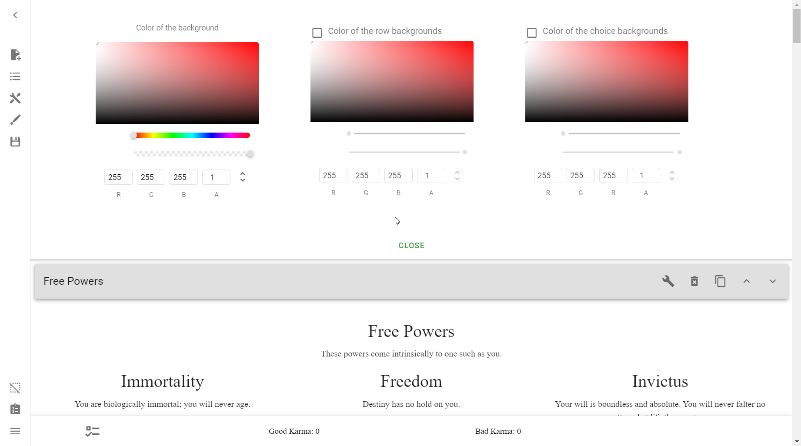

# Troubleshooting
Welcome to the Troubleshooting section. Have a bug? It should be listed here,
with any solutions documented.

If you encounter a bug that is not on this list, please comment below. If
anyone knows of a fix it will be documented here so future creators will know
how to solve it.

If you encounter a bug, don't find the solution on here, but find a fix, please
comment below! The more that people know about the solution the less problems
everyone has.

## The Creator

### I'm stuck in the Alternate Menu
See [here](/basics/#returning-to-the-default-menu).

### There's no sidebar, only a topbar
You may be in the Alternate Menu. See
[here](/basics/#returning-to-the-default-menu).

### There's no sidebar or topbar
Try scrolling up. The Alternate Menu can only be seen at the very top of the
page. Afterward, See [here](/basics/#returning-to-the-default-menu).

## Mechanics
<!-- Fill this with actual logical troubleshooting -->
### My Points say "NaN" instead of a number
[NaN] stands for "Not A Number", and occurs when JavaScript errors when
expecting any of its arguments to be valid numbers.

To fix this, go into **the Sidebar** → **Open Features** → **Manage Points** →
and set the **Starting Sum** of the offending Point Type to `0` or whatever
value it was before. You may notice the field is blank, and, indeed, not a
number.

!!! warning

    This is a band-aid solution and probably not the root of the issue; it is
    very likely that somewhere in your project you have an invalid value trying
    to be added or subtracted against that Point Type. Look **everywhere** for
    it.

## Design
### I can't find the option to upload a background image
This creator is rather buggy at times, and sometimes it hides the options:
**Upload Background Image**, **Upload Row Image**, and **Upload Object Image**
in the **Manage Background Design** section.

Here's an example of what that might look like when bugged:

There are two methods of fixing this, both of which will be displayed here.

Either:

1. [Zoom in and out][zoom], or
2. Resize the window

=== "Zooming"

    

=== "Resizing with Console"

    !!! tip

        You can open the console by going ++ctrl++ + ++shift++ + ++i++.

    

=== "Resizing entire window"

    

!!! tip

    You should probably just focus on [zooming][zoom] instead of resizing,
    as resizing the window gets a bit tricky sometimes.

!!! warning

    If this bug occurs to you, exiting the Creator and coming back in will 
    probably reset the fix, meaning you will have to do this everytime you
    encounter the issue.

### My Row is invisible for some reason
There could be many possibilities. Here are some:

1. It has some requirement that it's not fulfilling
    * If there is one and you're sure the requirement *should* be fulfilled,
    check the IDs again. There could be a mismatch by a typo.
2. It has an empty title
    * If this is indeed the case, and you don't want a title but still want the
    background visible, simply put an empty space ` ` there.

<!-- URLs -->
[zoom]: ../appendix/reference/#zoom-in-and-out
[NaN]: https://developer.mozilla.org/en-US/docs/Web/JavaScript/Reference/Global_Objects/NaN