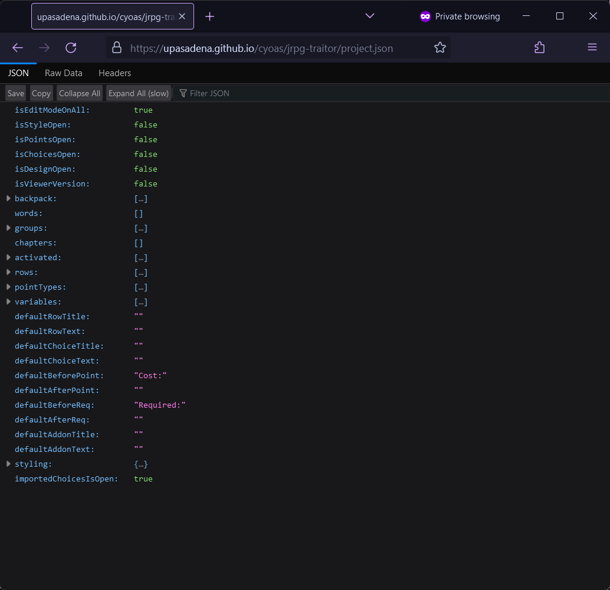
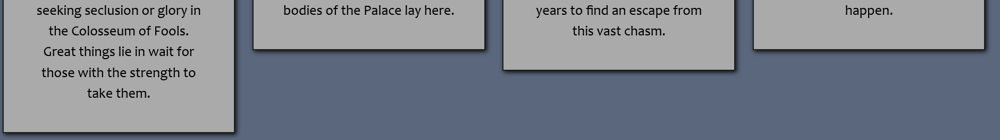
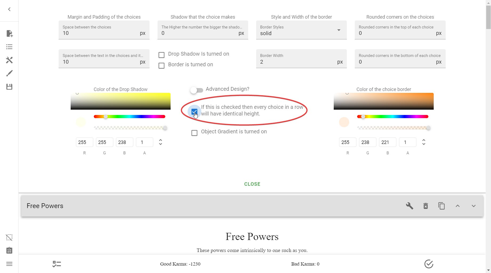

# Troubleshooting
Welcome to the Troubleshooting section. Have a bug? It should be listed here,
with any solutions documented.

If you encounter a bug that is not on this list, please comment below. If
anyone knows of a fix it will be documented here so future creators will know
how to solve it.

If you encounter a bug, don't find the solution on here, but find a fix, please
comment below! The more that people know about the solution the less problems
everyone has.

## The Viewer

### I tried to open index.html on my computer, but the CYOA won't load
That is because it won't load as it is. The way the Viewer works is that it can
only properly access and view the `project.json` when it is either on a web
server or with some manual hacking.

You actually *can* view it locally, but not out of the box.

#### Method 1: Web Server
To do so with a web server, you must install a web server. There are tons of
web servers that you can locally host, such as [XAMPP] for Windows.

[XAMPP]: https://www.apachefriends.org/download.html

Alternatively, if you have [Python], you can run this command where your
`index.html` file is to start a lightweight HTTP server:

[Python]: https://www.python.org/

=== "Normal"

    ```sh
    python -m http.server 7778
    ```

=== "Run in the background"

    ```sh
    python -m http.server 7778 &
    ```

Replacing `7778` with any number. Then, go into your browser at
[http://localhost:7778](http://localhost:7778) to view the CYOA.

#### Method 2: Manual editing
You can do this without a web server, if, for example, you cannot download one
or set it up for whatever reason.

u/PNG-MAN has a tutorial on how to do this [here][manual-host].

[manual-host]: https://old.reddit.com/user/PNG-MAN/comments/y03ftf/interactive_cyoa_tips_tricks_intcyoacreator/

### I tried to load my CYOA on a website, but the CYOA won't load
Make sure that all of your Viewer files and project.json are in the exact same
folder. Your folder structure should look like this:

```
my-cool-cyoa/
├────────── css/
├────────── js/
├────────── index.html
└────────── project.json
```

Also, make sure you're loading from the folder itself, not the `project.json`.

### I tried to load my CYOA, but the CYOA loads something different

#### Loading project.json
If your screen looks like this:

=== "Chrome"

    

=== "Firefox"

    

Then you are loading the `project.json` file instead of the `index.html` file,
which actually loads the CYOA. `project.json` is simply a configuration file
storing all of the data.

To fix this, simply delete `project.json` from the URL, and it should load
automatically!

### My choices are not all the same size
If your choice's started looking like this:



When you haven't changed a thing, then try exiting out of Edit mode of all the
Rows when in the Creator, and *then* open it in the Viewer[^choice-height].



---

Otherwise, go into **the Sidebar** → **Modify Design** →
**Manage Choice Design** → and check that you have the
**If this is checked then every choice in a row will have identical height**
option selected.

### I'm having issues with the Point Bar on mobile

#### The Point Bar isn't fixed
To fix this, you must go into your `index.html` file and add this to the
`<head>` section:

```html
<meta name="viewport" content="width=device-width,initial-scale=1.0 minimum-scale=1.0">
```

!!! warning

    If there is an existing `<meta>` tag, remove it and use the one above.
    There must only be one per viewport. See [here][vp] for more information.

[vp]: https://developer.mozilla.org/en-US/docs/Web/HTML/Viewport_meta_tag

This will make the bottom bar fixed correctly at bottom[^d-int].

#### The Point Bar has too many Point Types and I can't see them all
This is a common issue on mobile due to an excess of point types being common
with larger CYOAs.

First, if you have an excess of point types I would suggest making a
[Points Menu], allowing Point Types to be hidden at the behest of the user.
This gives them complete control and may allow them to better focus on the
CYOA.

[Points Menu]: /appendix/reference/#todo-show-points-menu

Second, to fix this issue permanently, add this to the `<body>` section:

```html
<style>
.v-bottom-navigation.v-item-group.theme--light.v-bottom-navigation--fixed {
    height: 65px !important;
    width: 100%;
    overflow-x: auto;
    white-space: nowrap;
    display: flex;
    justify-content: space-around;
    position: fixed;
    --obj-height: 65px;
    bottom: unset;
    top: calc(100vh - var(--obj-height));
    z-index: 1000;
}
</style>
```

Alternatively, you can make a custom CSS file, putting this code in:

```css
.v-bottom-navigation.v-item-group.theme--light.v-bottom-navigation--fixed {
    height: 65px !important;
    width: 100%;
    overflow-x: auto;
    white-space: nowrap;
    display: flex;
    justify-content: space-around;
    position: fixed;
    --obj-height: 65px;
    bottom: unset;
    top: calc(100vh - var(--obj-height));
    z-index: 1000;
}
```

and importing it like so, in the `<head>` section of your HTML, where
`custom.css` is the path to your CSS file:

```html
<link rel="stylesheet" type="text/css" href="custom.css">
```

This will make your Point Bar slightly taller and able to be scrolled
horizontally[^d-int].

#### I'm on Firefox Mobile and these fixes don't work!
This seems to be an issue with Firefox Mobile itself, and is a client-side
issue. To fix that as a user, you must go into the Accessibility option in
settings and turn off pinch and zoom on all websites[^d-int].

## The Creator

### I'm stuck in the Alternate Menu
See [here](/basics/#returning-to-the-default-menu).

### There's no sidebar, only a topbar
You may be in the Alternate Menu. See
[here](/basics/#returning-to-the-default-menu).

### There's no sidebar or topbar
Try scrolling up. The Alternate Menu can only be seen at the very top of the
page. Afterward, See [here](/basics/#returning-to-the-default-menu).

## Mechanics
<!-- Fill this with actual logical troubleshooting -->
### My Points say "NaN" instead of a number
[NaN] stands for "Not A Number", and occurs whenever JavaScript errors when
it's expecting any of its arguments to be valid numbers.

To fix this, go into **the Sidebar** → **Open Features** → **Manage Points** →
and set the **Starting Sum** of the offending Point Type to `0` or whatever
value it was before. You may notice the field is blank, and, indeed, not a
number.

!!! warning

    This is a band-aid solution and probably not the root of the issue; it is
    very likely that somewhere in your project you have an invalid value trying
    to be added or subtracted against that Point Type. Look **everywhere** for
    it.

### I switched from local images to external images, but the file size is still the same

!!! note

    Credit to Valmar for this solution.

If you remove an image and the image remains on the choice and it shows blank
in the "Upload Image" section, with the file size remaining identical, then
follow these steps:

1. Upload a new image
2. Manually remove that image. This "resets" the Choice

The file size should now be changed.

## Design
### I can't find the option to upload a background image
This creator is rather buggy at times, and sometimes it hides the options:
**Upload Background Image**, **Upload Row Image**, and **Upload Object Image**
in the **Manage Background Design** section.

Here's an example of what that might look like when bugged:


There are two methods of fixing this, both of which will be displayed here.

Either:

1. [Zoom in and out][zoom], or
2. Resize the window

=== "Zooming"

    

=== "Resizing with Console"

    !!! tip

        You can open the console by going ++ctrl++ + ++shift++ + ++i++.

    

=== "Resizing entire window"

    

!!! tip

    You should probably just focus on [zooming][zoom] instead of resizing,
    as resizing the window gets a bit tricky sometimes.

!!! warning

    If this bug occurs to you, exiting the Creator and coming back in will 
    probably reset the fix, meaning you will have to do this every time you
    encounter the issue.

### My Row is invisible for some reason
There could be many possibilities. Here are some:

1. It has some requirement that it's not fulfilling
    * If there is one and you're sure the requirement *should* be fulfilled,
      check the IDs again. There could be a mismatch due to a typo
2. It has an empty title and description
    * If this is indeed the case, and you don't want a title and/or description
      but still want the background visible, simply put an empty space "` `"
      there

## Publishing
### I've uploaded my site to Neocities but it won't load
I have encountered this issue many times. This is a failure on Neocities's end,
and it happens when uploading the Viewer.

When the upload of your CYOA to Neocities is finished, sometimes many parts of
the Viewer will not upload, so manually go into the `js/` and `css/` folder and
reupload files that are not there.

<!-- Footnotes -->
[^choice-height]: Credit to `Hydrogen Peroxide` and `Valmar` on Discord for
  this fix.
[^d-int]: Credit to `DelicateIntegral` on Discord for these tips and to
  `spartango` for making suggested changes.

<!-- URLs -->
[zoom]: /appendix/reference/#zoom-in-and-out
[NaN]: https://developer.mozilla.org/en-US/docs/Web/JavaScript/Reference/Global_Objects/NaN

<!-- BUFFER -->
