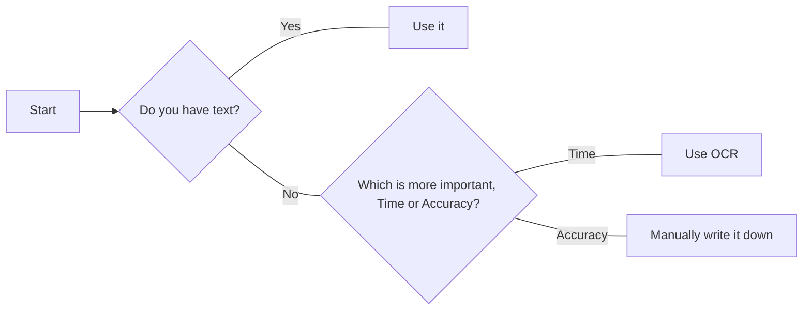
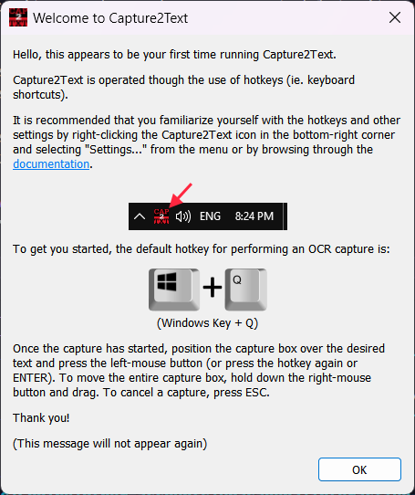
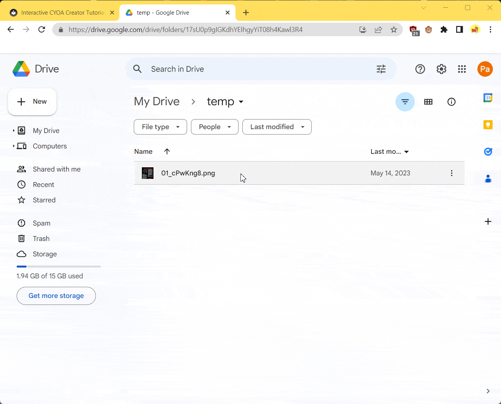
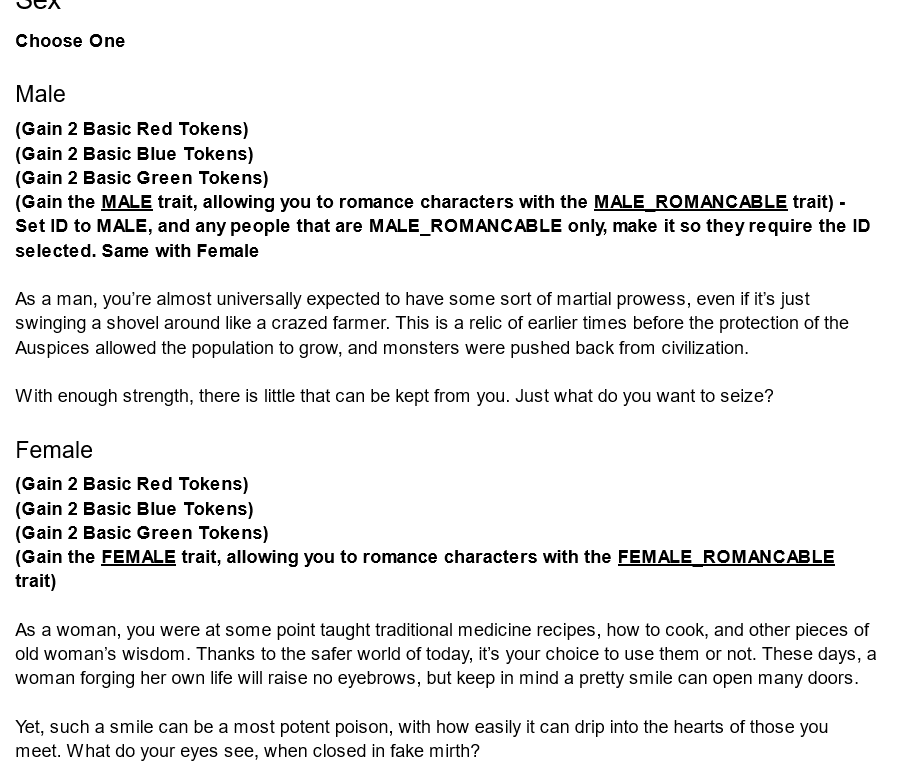

# Creating Your CYOA
This section is focused on how to actually create your CYOA, step-by-step.

The basic structure of creating a CYOA looks like this:

* Step 1: [Sourcing](#sourcing)
* Step 2: [Planning](#planning)
* Step 3: [Creating](#creating)
* Step 4: [Publishing](#publishing)
* Step 5: [Improving](#improving)

We'll go into each section below.

## Sourcing
The first thing you need to worry about is where you're going to find the
source of your Interactive CYOA.

If it's an original work, this step is easy, and you should have already made
your own plan regarding how the Interactive will go. If it's someone else's
that you're adapting, however, it could get tricky.

### Adapting a Static
If you're adapting a Static CYOA there are four main ways to go about this:

1. If a text version is available (or if the static *is* originally text), make
   sure you have an editable copy of the document, and go straight into the
   [Planning](#planning) section.
2. If a text version is not available you've got two other methods:
    1. You use OCR (Optical Character Recognition) to automatically detect
       characters within the images. Faster than the below, but depending on
       the background, text, and resolution accuracy can suffer, thus requiring
       more correction than necessary.
    2. Otherwise, you have to manually type it up. This is incredibly
       time-consuming, and should be avoided if the CYOA is very large.
3. Just ask the original authors if you can get their document on it. This
   isn't possible if, for example, the original author was anonymous on 4chan
   or has been offline since. Certain authors may refuse because they don't
   want an Interactive CYOA.

Essentially:



Don't forget that you can mix and match the last two methods, using OCR on text
with a simple background and a larger font, while manually writing the harder
text.

### OCR
Here are a few OCR programs:

* [Capture2Text](https://capture2text.sourceforge.net/) – A program that allows
  you to make screenshots with assigned keys and get text from them, without
  having to OCR an entire file.
* [gImageReader](https://github.com/manisandro/gImageReader) – A GUI for
  `tesseract-ocr`. You can add multiple images and process them in one text.
* [tesseract-ocr] – A command-line program for advanced users.
* [ocr_scan.py](/static/ocr_scan.py) – A [Python](https://www.python.org/)
  script I created that automatically calls [tesseract-ocr] on all images in a
  folder. Defaults to PNG files, change in the file for other file types.
* Adobe Acrobat – Has an OCR feature, but may cost money

[tesseract-ocr]: https://github.com/tesseract-ocr/tesseract

Here is the source code of `ocr_scan.py`. Feel free to take this and modify it,
it is licensed under the [MIT] licence.

[MIT]: https://opensource.org/license/mit/

??? info "Source code"

    ```python
    import os
    import glob

    OUTPUT_FOLDER = "results"

    image_files = [f for f in glob.glob("*.png")]   # Switch to .jpg or other types
                                                    # according to your use case

    os.system(f"mkdir {OUTPUT_FOLDER}")

    print("Scanning files now…")

    for i, image in enumerate(image_files):
        print(f"[Scanning image {i+1} of {len(image_files)}]")
        os.system(f"tesseract \"./{image}\" \"./{OUTPUT_FOLDER}/{image}\"")

    print("Completed!")
    ```

#### Capture2Text
!!! note

    Capture2Text is only available for Windows. Linux and Mac users will have
    to use another method.

First, [download the latest version][c2t-dl].

[c2t-dl]: https://sourceforge.net/projects/capture2text/files/Capture2Text/

Next, unzip it, and place it somewhere where you wont delete it on accident
(your Downloads file is a bad place, for example).

If you wanted to use the CLI interface it provides, add it to your PATH (Google
it) so that you can access it from Powershell/Command Prompt.

If you wanted to add the application to your apps list in the Windows menu,
right click the application → Send to Desktop (Shortcut). Copy that shortcut
and paste it in
`C:\Users\YOURUSERNAME\AppData\Roaming\Microsoft\Windows\Start Menu\Programs`.
This will add it to your Windows menu. Try searching for it.

When you launch it for the first time, you will be greeted with this screen:



Memorize the default action (++windows++ + ++q++).

Next, open up the image(s) you wanted to OCR, line up your cursor somewhere in
the corner of the text you wanted to OCR, and press the default action.


Here is a gif:


##### Line breaks
If you are like me, you will encounter the text inconveniently having a line
break after every line instead of being one big large chunk of text, like this:

> Greetings, rudimentary creatureff flesh
>
> blood. I am known as the Dark 0 e. You
>
> probably wondering why I've bro ght yc
>
> You died, as all mortals do. As all ortal:
>
> But I have plucked your soul fro the vc
>
> specific purpose. It is rare to find soul \
>
> compatible with the transfigurati n proc
>
> even rarer that the soul isn't des royed,
>
> seem to be handling it well enou h. Usu
>
> subject just explodes the momen we st;

Instead of one big line of text like this:

> Greetings, rudimentary creatureff flesh
blood. I am known as the Dark 0 e. You
probably wondering why I've bro ght yc
You died, as all mortals do. As all ortal:
But I have plucked your soul fro the vc
specific purpose. It is rare to find soul \
compatible with the transfigurati n proc
even rarer that the soul isn't des royed,
seem to be handling it well enou h. Usu
subject just explodes the momen we st;

You fix this by copying and pasting the text into this site:
[https://24toolbox.com/newline-remover/][nlr] and pressing
**Remove All Newlines**.

[nlr]: https://24toolbox.com/newline-remover/

This will remove the newlines at the end of a text, combining it back into one.

---

For additional help, consult the [documentation][c2t-docs].

[c2t-docs]: https://capture2text.sourceforge.net/

#### Tesseract
You will need to follow the instructions [here][t-dl].

[t-dl]: https://tesseract-ocr.github.io/tessdoc/Installation.html

Other options here like [Capture2Text](#capture2text) actually use Tesseract as
a backend.

#### ocr_scan.py
First, [install Tesseract](#tesseract). Second, make sure that it is in your
PATH. Third, [install Python](https://www.python.org/) and make sure you tick
the option that puts Python in your PATH.

Then, get the script from [static/ocr_scan.py](/static/ocr_scan.py), and run it
in a folder with images.

By default it will detect PNG files. Edit the file and look for `.png` and
change that to `.jpg` or `.jpeg` for JPG files.

Then, run it in the terminal, and it will output text files for each image.

#### Google Docs
Using Google Docs as an OCR tool is relatively easy, but you can only do it for
one image at a time. However, as it's from Google, it is relatively accurate.

Simply right click an image file → **Open With >** → **Google Docs**.

Here's an example of it:



This can be especially useful since Google Docs has its in-built spellchecker
and grammar checker.

## Planning
The next thing you should do is plan how you're going to incorporate mechanics
into your CYOA. I recommend doing this in where you've got the text of the CYOA
that you will be putting in the Creator (I recommend Google Docs).

Go through each option in the document, and consider how it can be achieved via
the [Mechanics](/mechanics/) of the ICC. If a choice requires a previous
option, write down by the choice's text that it needs a **Selected Choice**
requirement for this other choice, etc.

Here's an example from my plan of the JRPG Traitor Interactive (which is 259
pages long…):

!!! example ""

    

As you can see, I integrated the text with the mechanics (marking the mechanics
in bold and the text normally), such that when I go through each option when
actually [creating](#creating) the CYOA, I would know what I would need to do,
without needing to rethink a solution.

## Creating
Now for creating, it's rather simple (though not necessarily easy, depending on
your CYOA and skill level) to create. Just go through each of the choices which
you have now marked and implement the mechanics.

By the end of it you should have a mechanically-finished CYOA without styling
or images that is playable. After that it is, feel free to add images and
styling:

=== "Finished"

    

=== "Styled"

    

### Styling
One thing you have to consider before styling is whether to try to make your
Interactive CYOA as close to the original as possible, to allow for minute
changes in order to make it more enjoyable to play, or to completely change the
design.

I recommend sticking as close as possible except where improvements can be
made, because a lot of your audience will be people who love the original.
However, if the design is bad or non-existent, it stands to reason that you
should make your own design.

See the [Styling](/styling/) section for more.

## Publishing
Once your CYOA is officially complete and you want to release it, you will want
to publish it to a site.

This topic is covered in more detail in the [Publishing](/publishing/) section.

## Improving
The final step is to improve! Be on the lookout for comments that talk about
bugs and errors, spelling mistakes, suggestions, etc. These are invaluable to
refining your Interactive and making it better and better.

Many people will release their CYOA before it is done or finished in a "WIP",
"Alpha", or "Beta" stage in order to get suggestions before it is officially
released for the first time. You can do this if you wish.

## Final words
And with that said, go ahead and create! I think all people's first attempt
won't produce the best CYOA ever, but as with a lot of things, the more you do
something and the more you practise it, the better you will get at it. So go
ahead and try! Start small, and work your way up. And don't forget to post it
to a CYOA subreddit so the rest of the community can play it and give feedback!
