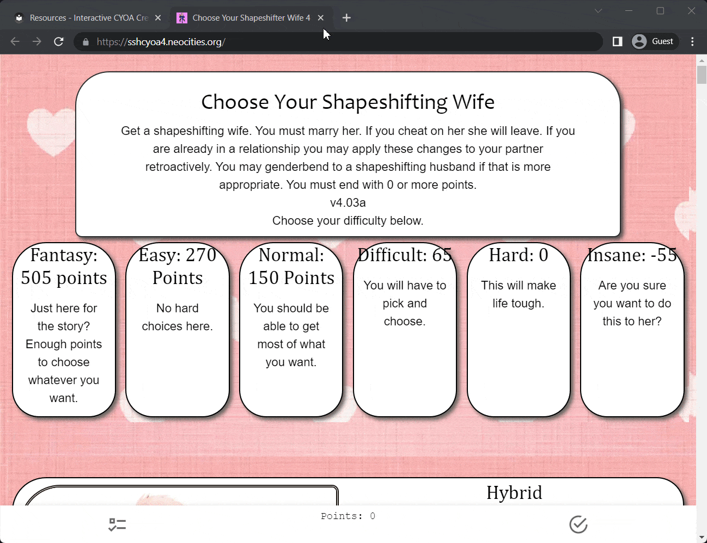
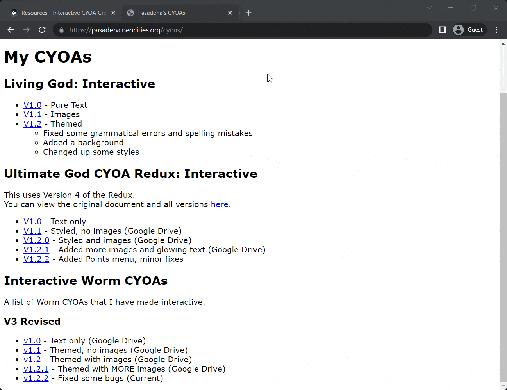
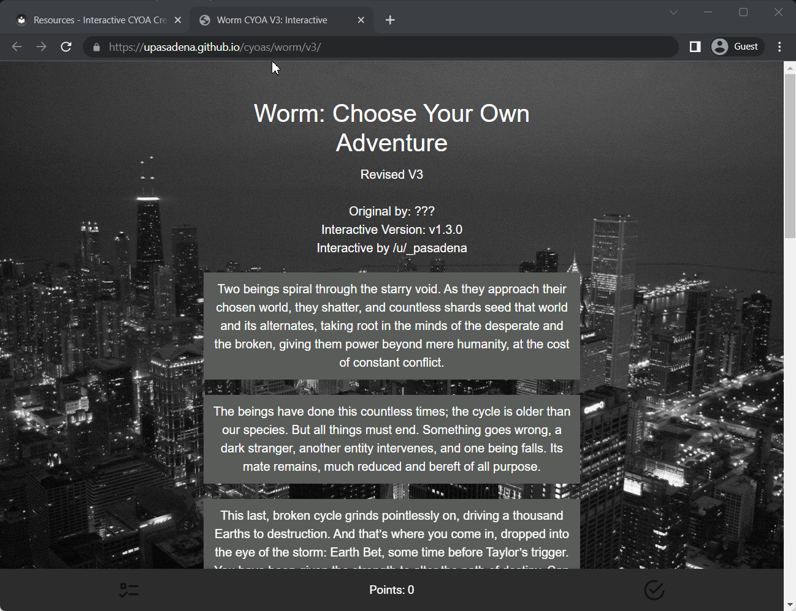
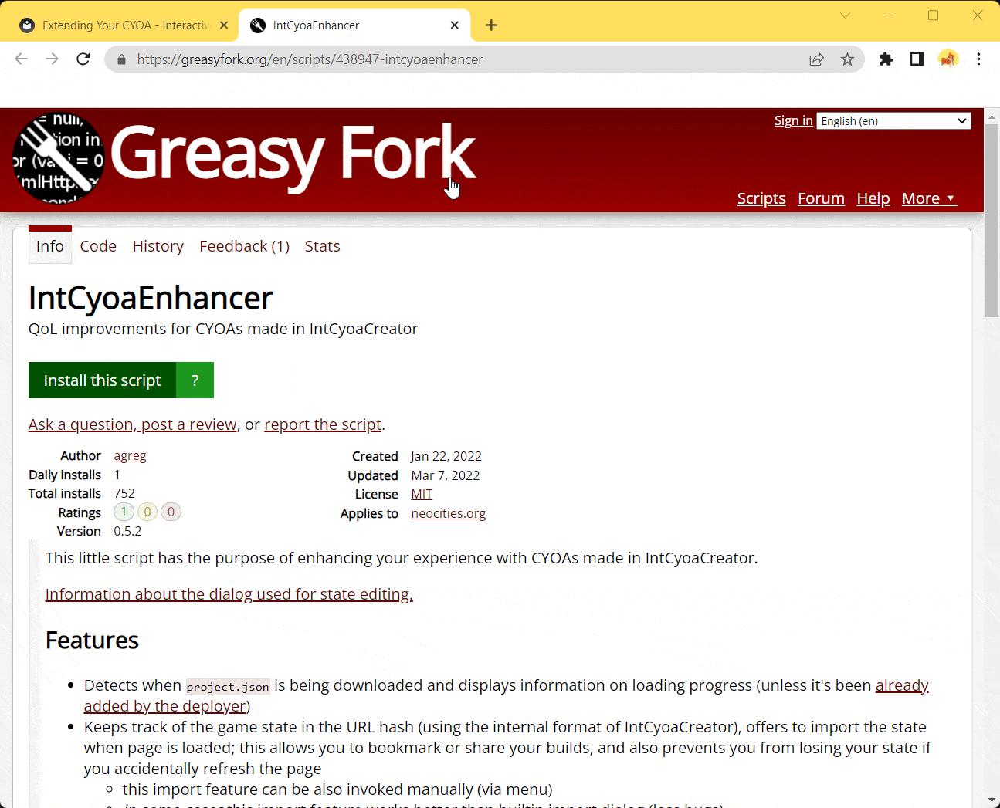
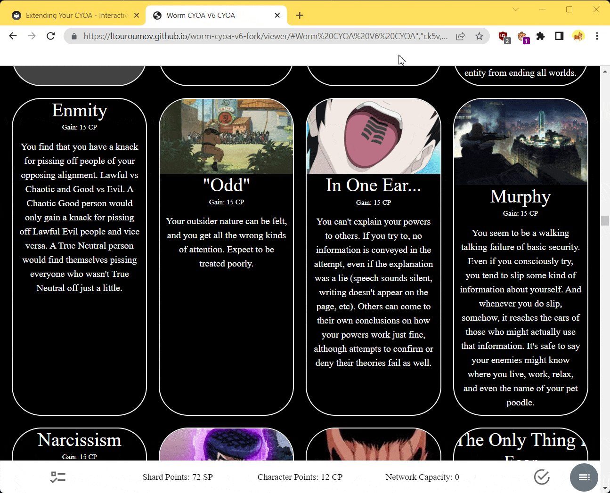

# Extending Your CYOA
Congratulations, you have learnt the core mechanics of the Interactive CYOA
Creator! However, this does not mean you are finished yet. There are more
things you could add and modify using external tools and code. This section
deals with all that, and more.

## Progress Indicator
By default, Interactive CYOAs load with a blank white screen. This is fine for
smaller CYOAs, but when it gets larger then depending on their internet speed,
players can become unsure if it will ever load at all.

Therefore, adding a loading progress indicator is strongly recommended for big
projects.

Compare having the progress indicator vs. not having it:

=== "Progress Indicator Present"

    

=== "Progress Indicator Absent"

    

    <sub>
    And yes, I am aware that that's my CYOA that doesn't have a progress
    indicator :P
    </sub>

### Adding the Progress Indicator
How do you add it to your CYOA then? It's simple, add this to your `index.html`
file, in the `<body>` section, but above `<div id="app">`.

!!! tip

    When it comes to code blocks like the one below, press the button in the
    top right in order to copy the entire block to your clipboard.

```html title="IntCyoaCreator download progress indicator by Agregen"
<!-- Insert the following in the beginning of <body> (on the line above <div id="app">) -->
<div id="indicator">
  <script>
    {
      let _XHR = XMLHttpRequest;
      XMLHttpRequest = class XHR extends _XHR {
        constructor() {
          super();
          this.addEventListener('progress', e => {
            indicator.innerText = " Loading data: " + (!e.total ? `${e.loaded} bytes` :
              `${(100 * e.loaded / e.total).toFixed(2)}%`)
          });
          this.addEventListener('loadend', () => {
            indicator.innerText = ""
          });
        }
      }
    }
  </script>
</div>
<!-- Modifier: replace `${e.loaded} bytes` with `${(e.loaded/1024**2).toFixed(1)} MB` to display size in MB -->
<!-- Modifier: replace the part after " Loading data: " with `${(100 * e.loaded / (e.total||SIZE)).toFixed(2)}%` to
                 always show percentage (SIZE is project.json size in bytes; remember to replace it on every update) -->
```

However, the above script loads in terms of bytes, which isn't really legible
nowadays. Use the below script instead to load in terms of megabytes:

```html title="IntCyoaCreator download progress indicator by Agregen"
<div id="indicator">
  <script>
    {
      let _XHR = XMLHttpRequest;
      XMLHttpRequest = class XHR extends _XHR {
        constructor() {
          super();
          this.addEventListener('progress', e => {
            indicator.innerText = " Loading data: " + (!e.total ? `${(e.loaded/1024**2).toFixed(1)} MB` :
              `${(100 * e.loaded / e.total).toFixed(2)}%`)
          });
          this.addEventListener('loadend', () => {
            indicator.innerText = ""
          });

        }
      }
    }
  </script>
</div>
```

Here's how loading with megabytes looks (blink and you'll miss it):



## IntCYOAEnhancer script
The **IntCYOAEnhancer script** by [agregen] is a script hosted on Greasy Fork
which adds features on the client-side when playing CYOAs. It is available
[here][intcyoaenhancer]. Unlike the others on this list, this doesn't enhance
your ICYOAs as a creator, but as a player.

Some of the features of this script include:

* A download progress indicator (see [here](#progress-indicator) for adding
  that to your own CYOA, whether they have this script or not)
* Game state tracking, meaning if you reload on accident you can keep your
  choices
* An overview of selected choices and sections
* An option to enable the backpack (where you can export your choices for
  import again) if it's not already enabled
* A download option for any interactive's project.json file
* A cheat engine to change points
* And so much more

!!! question "Why should I bother to add the Progress Indicator if people could just use this script?"

    Many reasons: they might not know about it, they might not know how to
    install it, they might not be able to install it, the list goes on.

    It's simply a nice gesture to add the progress indicator, whether 

### Installing the Enhancer
To install this script, you first must install a relevant user script manager
addon. See [here](https://greasyfork.org/en) for a list of addons next to your
browser.

Next, navigate to the script page [here][intcyoaenhancer].

Simply press **Install this script** to add it to your script manager.



After that, open up the IntCyoaEnhancer script and edit it, and look for a line
that looks like this:

```js
// @match        https://*.neocities.org/*
```

Under that line, copy and paste these lines:

```js
// @match        https://*.github.io/*
// @match        https://*.gitlab.io/*
```

Many CYOAs are hosted on GitHub ([Lt Ouroumov's Worm CYOA V6] and my CYOAs, for
example). Less people use GitLab, but *agregen*, the author of this script
does, so it's there just in case.

### Overview
Now when you load into any Interactive CYOA you should notice something in the
bottom right. This is the button that opens the **Overview** overlay, and it's
a sign that the installation is working as intended.


Pressing on that should yield the Overview menu. In this, you'll be able to
do three things:

1. See an outline of the entire CYOA (allowing for ease of copying your choices
to display on social media).
2. Navigate through the entire CYOA via Rows.
3. Roll a die/dice for RNG sections.


#### Activated
This is the list in the middle. You can hover over the bolded text that
represent your options in order to see their ID, descriptions, and Scores. It
also shows its Image if it has one.

#### Navigation
This is on the right-hand side. Press any of the Row Titles in order to jump to
there. A very convenient tool.

#### Dice Roll
On the left side. This allows you to roll a dice for sections of the CYOA that
require you to roll a die or dice to get your result.

`NdM+K` means rolling an M-sided die N times and adding K to the total.

### Toolbar
You can access even more functions by pressing your script manager (mine being
Violentmonkey in this case) in your toolbar (if you have it pinned. if it's not
pinned, you should search for it by pressing the jigsaw puzzle piece.
considering pinning Violentmonkey if you're a big ICYOA fan).


As you can see from that list, this tool is capable of quite a lot more.

#### Change webpage title
Many ICYOA creators do not know or do not care that you can change the title of
your websites in `index.html`. This can be frustrating when having many ICYOAs
open, and not being able to tell between them without switching to them.

This tool helps with that, in that it lets you change the title easily.


#### Edit state
This lets you edit currently selected choices.

As an example, I will activate the ID `vllg`, which corresponds to the
`In One Ear...` choice:



This can be useful in CYOAs that do not have a Backpack and Choice Import.

#### Toggle full scan mode
Full Scan mode is a togglable mode that changes the way that the Enhancer saves
data.

The Author says (paraphrased):
> It keeps track of all changes in app state; this overrides the default game
> state hash, including restoring the state on load and editing of the state
> string; this allows for storing state in apps where ids list import fails.
>
> This can be toggled on and off at any time, switching between IDs list and
> full scan snapshot.
>
> The state of both backpack and cheat add-ons is stored (and restored on load)
> as well.
>
> Implemented a multiline editor with JSON pretty-formatting (adjustable),
> highlighting and validation. (Also used for IDs list but without JSON
> features).

You can tell when it is in Full Scan mode by the colour of the bottom-right
Overview menu button. If it is dark, it is off. If it is light, it is on.

#### Downloading project data
This setting allows you to download a project's `project.json`, regardless of
how it is stored. For example, a few ICYOAs store their `project.json` data
inside of their `app.c533aa25.js`, and some store it in their `index.html`.
This option allows you to download the `project.json` in spite of that, which
is incredibly handy.

!!! warning

    This downloads the `project.json` in its current state.

    That means if you have selected some choices, when you load that
    `project.json` into the Creator, you'll have to deselect them if you wanted
    the project clean.


#### Overview (Toolbar)
This just opens the [Overview](#overview) menu.

#### Cheat engine
This opens up the Cheat Engine. The Cheat Engine allows you to change any sort
of values.

!!! note

    Check out [launchcode01dl's Modded CYOAs] for a collection of Modded
    ICYOAs.

## Modded Viewer
!!! note

    Credit to [Om1cr0n](https://wormlewdmod.neocities.org/about) for this code.

In your project's `js` folder, replace `app.c533aa25.js` with the one from
==**[here](../static/fixed-app/app.c533aa25.js)**==. It's a fixed version that:

1. Doesn't sanitize `href`, `target`, and `rel` attributes in `<a>` tags in the
   HTML, enabling hyperlinking. See [here][a] for more.
2. Doesn't sanitize `` tags in the HTML, allowing custom image insertion.
   See [here][img] for more.
3. Doesn't sanitize the `src` attribute in `` tags.
4. Doesn't sanitize the `content` property in CSS, allowing arbitrary insertion
   of content via CSS. See [here][content] for more.

??? info "How it works"

    How does this work? Well, in the original `app.c533aa25.js` the author made
    it so that only specific html tags and attributes were allowed, and
    anything else would be "sanitized" (removed).

    We can take a deeper look if we run a `git diff` on the two files:

    ```diff
    diff --git a/pretty_app.js b/pretty_app.js
    index 6d6a7a6..1d8323a 100644
    --- a/pretty_app.js
    +++ b/pretty_app.js
    @@ -1008,8 +1008,10 @@
            data: function () {
            return {
                sanitizeArg: {
    -              allowedTags: ["address", "article", "aside", "footer", "header", "h1", "h2", "h3", "h4", "h5", "h6", "hgroup", "main", "nav", "section", "blockquote", "dd", "div", "dl", "dt", "figcaption", "figure", "hr", "li", "main", "ol", "p", "pre", "ul", "a", "abbr", "b", "bdi", "bdo", "br", "cite", "code", "data", "dfn", "em", "i", "kbd", "mark", "q", "rb", "rp", "rt", "rtc", "ruby", "s", "samp", "small", "span", "strong", "sub", "sup", "time", "u", "var", "wbr", "caption", "col", "colgroup", "table", "tbody", "td", "tfoot", "th", "thead", "tr"],
    +              allowedTags: ["img", "address", "article", "aside", "footer", "header", "h1", "h2", "h3", "h4", "h5", "h6", "hgroup", "main", "nav", "section", "blockquote", "dd", "div", "dl", "dt", "figcaption", "figure", "hr", "li", "main", "ol", "p", "pre", "ul", "a", "abbr", "b", "bdi", "bdo", "br", "cite", "code", "data", "dfn", "em", "i", "kbd", "mark", "q", "rb", "rp", "rt", "rtc", "ruby", "s", "samp", "small", "span", "strong", "sub", "sup", "time", "u", "var", "wbr", "caption", "col", "colgroup", "table", "tbody", "td", "tfoot", "th", "thead", "tr"],
                allowedAttributes: {
    +                a: ["href", "target", "rel"],
    +                img: ["src"],
                    p: ["style"],
                    b: ["style"],
                    span: ["style"],
    @@ -1018,6 +1020,7 @@
                allowedStyles: {
                    "*": {
                    color: [/^#(0x)?[0-9a-f]+$/i, /^[A-Za-z]+$/, /^rgb\(\s*(\d{1,3})\s*,\s*(\d{1,3})\s*,\s*(\d{1,3})\s*\)$/],
    +                  content: [/^.*$/],
                    "text-align": [/^left$/, /^right$/, /^center$/],
                    "font-size": [/^\d+(?:px|em|%)$/]
                    },
    @@ -1191,6 +1194,7 @@
                sanitizeArg: {
                allowedTags: ["address", "article", "aside", "footer", "header", "h1", "h2", "h3", "h4", "h5", "h6", "hgroup", "main", "nav", "section", "blockquote", "dd", "div", "dl", "dt", "figcaption", "figure", "hr", "li", "main", "ol", "p", "pre", "ul", "a", "abbr", "b", "bdi", "bdo", "br", "cite", "code", "data", "dfn", "em", "i", "kbd", "mark", "q", "rb", "rp", "rt", "rtc", "ruby", "s", "samp", "small", "span", "strong", "sub", "sup", "time", "u", "var", "wbr", "caption", "col", "colgroup", "table", "tbody", "td", "tfoot", "th", "thead", "tr"],
                allowedAttributes: {
    +                a: ["href", "target", "rel"],
                    p: ["style"],
                    b: ["style"],
                    span: ["style"],
    @@ -1756,6 +1760,7 @@
                sanitizeArg: {
                allowedTags: ["address", "article", "aside", "footer", "header", "h1", "h2", "h3", "h4", "h5", "h6", "hgroup", "main", "nav", "section", "blockquote", "dd", "div", "dl", "dt", "figcaption", "figure", "hr", "li", "main", "ol", "p", "pre", "ul", "a", "abbr", "b", "bdi", "bdo", "br", "cite", "code", "data", "dfn", "em", "i", "kbd", "mark", "q", "rb", "rp", "rt", "rtc", "ruby", "s", "samp", "small", "span", "strong", "sub", "sup", "time", "u", "var", "wbr", "caption", "col", "colgroup", "table", "tbody", "td", "tfoot", "th", "thead", "tr"],
                allowedAttributes: {
    +                a: ["href", "target", "rel"],
                    p: ["style"],
                    b: ["style"],
                    span: ["style"],
    @@ -2215,6 +2220,7 @@
                sanitizeArg: {
                allowedTags: ["address", "article", "aside", "footer", "header", "h1", "h2", "h3", "h4", "h5", "h6", "hgroup", "main", "nav", "section", "blockquote", "dd", "div", "dl", "dt", "figcaption", "figure", "hr", "li", "main", "ol", "p", "pre", "ul", "a", "abbr", "b", "bdi", "bdo", "br", "cite", "code", "data", "dfn", "em", "i", "kbd", "mark", "q", "rb", "rp", "rt", "rtc", "ruby", "s", "samp", "small", "span", "strong", "sub", "sup", "time", "u", "var", "wbr", "caption", "col", "colgroup", "table", "tbody", "td", "tfoot", "th", "thead", "tr"],
                allowedAttributes: {
    +                a: ["href", "target", "rel"],
                    p: ["style"],
                    b: ["style"],
                    span: ["style"],
    ```

    Here we can see that the new `app.c533aa25.js` file simply adds an
    exception for `<a>` tags and the `href` attribute, allowing for
    hyperlinking.

## Using Git
What is Git? Git is a **version control system** (VCS). It is a program that
tracks changes within files and folders. Using Git, we can create snapshots of
changes for each version, meaning if we add irreversable changes to our
project, we can simply revert back to a previous version.

We can also compare changes between versions, and can invite others to
collaborate and see what they've changed, much like Wikipedia.

Using Git is for more advanced users and is not required.

You can learn about Git [here](https://git-scm.com/book/en/v2).

## Custom HTML, CSS, and JavaScript
You can truly supercharge your ICYOA by using HTML, CSS, and/or JavaScript.
Those three languages are the languages that every web browser runs on.

`HTML`

:   HyperText Markup Language. This language decides the general layout and
basic design of a web page.

`CSS`

:   Cascading Style Sheets. This language is what does the majority of the
styling. It's using this language that the most aethetically pleasing websites
you can think of achieve their look.

`JavaScript`

:   JavaScript is a scripting language. This language does the majority of the
logic and interactivity.

You can view some resources for learning HTML, CSS, and JavaScript over at
the [Resources](/appendix/resources/#programming-resources) section.

---

Learn more about [HTML], [CSS], and [JavaScript] in the [Reference].

<!-- URLs -->
[content]: https://www.w3schools.com/cssref/pr_gen_content.php
[img]: https://www.w3schools.com/tags/tag_img.asp
[a]: https://www.w3schools.com/tags/tag_a.asp
[agregen]: https://agregen.gitlab.io/
[Lt Ouroumov's Worm CYOA V6]: https://ltouroumov.github.io/worm-cyoa-v6-fork/viewer/
[intcyoaenhancer]: https://greasyfork.org/en/scripts/438947-intcyoaenhancer
[launchcode01dl's Modded CYOAs]: https://launchcode01dl.github.io/cyoa/
[Reference]: /appendix/reference/
[HTML]: /appendix/reference/#html
[CSS]: /appendix/reference/#css
[JavaScript]: /appendix/reference/#javascript

<!-- BUFFER -->