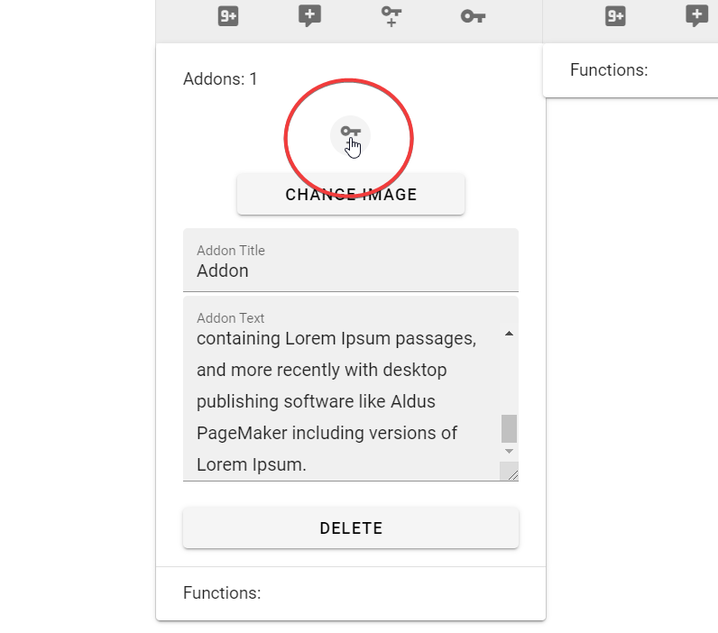
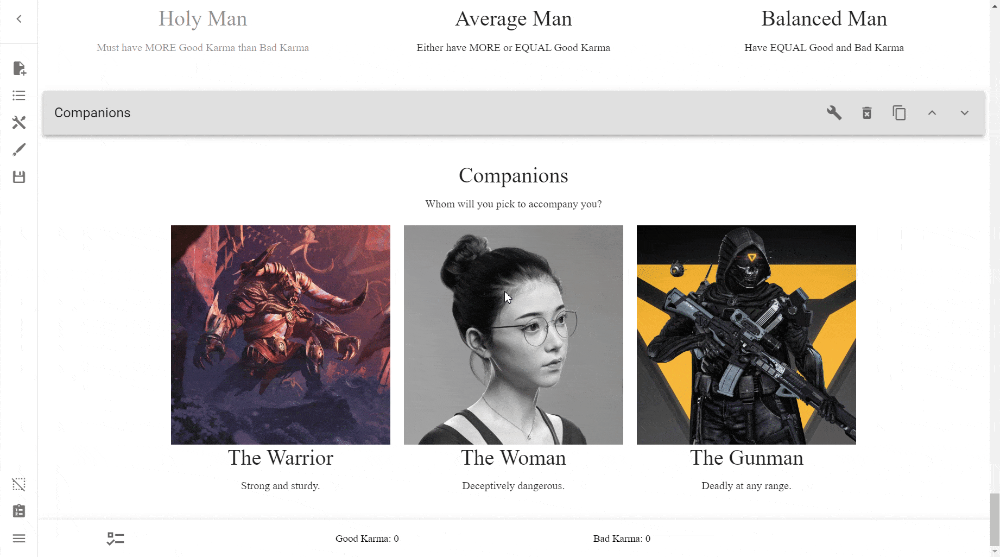

# Addons
What are Addons? Addons are essentially extra info blocks that can be attached
to a Choice. Each Addon can have its own image. This can be useful if a Choice
has multiple parts that each could benefit from an image.

## Adding Addons
Adding Addons to Choices is simple. In the **Edit Row** menu, scroll down to
the choice you wanted to add the Addon to. Then, press the message icon with a
\+ in it. This is the **Create Addon** button and will add an addon.

You will notice a new **Addons** section appears. Press on that to open it up,
and you will be granted access to the Addon's options.

## Addon Menu
The Addon menu is relatively simple. This is what it looks like:

### Addon Title
The title of the Addon.

### Addon Text
The body of the Addon text.

### Delete
This button deletes your Addon.

!!! warning

    This button does not ask before deleting. Ensure you do want to delete this 
    before pressing the button, and make sure you save frequently.

### Change Image
This allows you to upload an Image to your addon. It opens up [the image menu].

### Create Requirement
Perhaps the most interesting part of the Addon Menu, this option allows you to
make a requirement for that Addon to be selected. This can be useful if you
wanted to selectively show information depending on whether the user has chosen
a previous Choice, for example.

---

Here's what it looks like in action using a [selected choice]\ [requirement]:

=== "Result"

    

=== "Process"

    

---

Learn more about what you can do with Addons in the [Reference].

<!-- URLs -->
[the image menu]: ../images/#the-image-menu
[Reference]: /appendix/reference/
[selected choice]: ../ids-and-requirements/#selected-choice
[requirement]: ../ids-and-requirements/#requirements