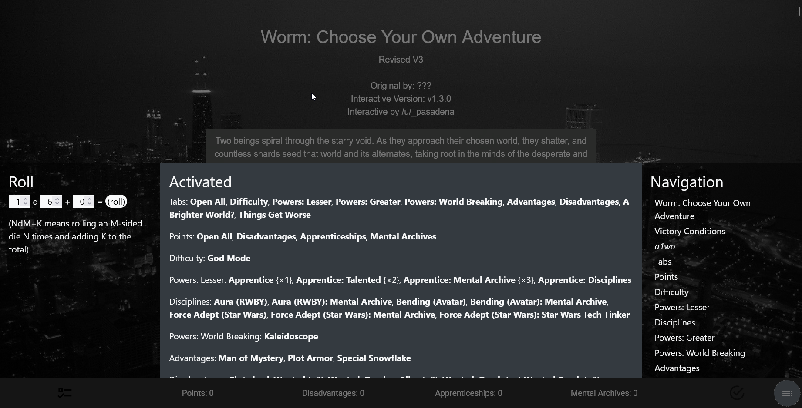
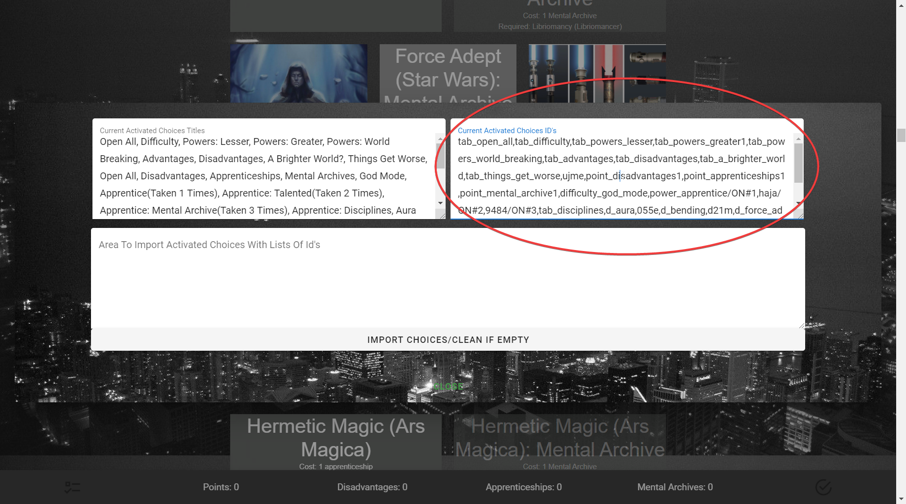
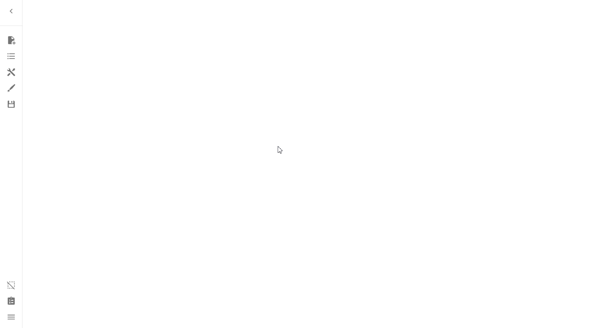

# Backpack & Choice Import
> The backpack is where rows can show which choices have been selected can be
> placed, and the import is where selected choices can be imported.

When you create a new CYOA with the ICC, by default both the Choice Import and
the Backpack will be disabled.

**You should change this**.

It is **highly** recommended you at least enable Choice Import, as it allows
players of your CYOA to save the Choices they've made to show off to others or
to import later, if they feel like tweaking around with the build.

## Choice Import
Choice Import is where selected Choices can be imported and exported.

### Enabling Choice Import
To Enable **Choice Import** is quite simple. Simply go into **the Sidebar** →
**Open Features** → **Manage Backpack and Choice Import**, and enable
**Dialog where selected choices can be imported with ID's**.

You will now notice in the bottom left there is a checklist button. Press on
that and it will open up the Choice Import menu.

### Choice Import menu
This is what the Choice Import menu looks like:

#### Current Activated Choices Titles
The **Current Activated Choices Titles** box shows the titles of the Choices
that have been selected/activated.

As an example from my Worm CYOA V3 Interactive:

While you *could* use these to show off what choices you picked to others,
consider using [IntCYOAEnhancer], which has an output like this:

As you can see, it's a much cleaner format, ready for a straight copy and
paste.

[IntCYOAEnhancer]: /extending-your-cyoa/#intcyoaenhancer-script

#### Current Activated Choices ID's
The **Current Activated Choices ID's** box shows the [IDs] of the Choices that
have been selected/activated.

[IDs]: /mechanics/ids-and-requirements/#ids-unique-identifiers

**This is what you copy if you wanted to save your Choices for later**. To load
your Choices, use the [Area To Import Activated Choices With List of Id's].

#### Area To Import Activated Choices With List of Id's
One of the most important areas, this is the box you would use to import
Choices from a [previously saved build][psb].

[psb]: #current-activated-choices-ids

To import, simply press the [Import Choices/Clean If Empty] button.

[Import Choices/Clean If Empty]: #import-choices-clean-if-empty

##### Import Choices/Clean If Empty
This button imports a previous build using the
[Area To Import Activated Choices With List of Id's].

---

Here's a live demo showing what the process looks like, using the Worm V3
Interactive again:

## The Backpack
The Backpack a place where Rows can show which Choices have been selected in a
graphical—rather than Choice Import's textual—format.

Here is what it looks like:

### Enabling the Backpack
To enable the Backpack, simply go into **the Sidebar** → **Open Features** →
**Backpack and Choice Import** → **Add New Backpack Row**.

You should then be able to see a checkmark icon on the bottom right, showing
that it was successfully enabled.

While you can continue to add more and more Rows, it is not needed, as just the
one Row will output all of your Choices.

Afterward, you can customize the Backpack Row like any other Row.

!!! question "How does it work?"

    The Backpack Row works like a normal Row, except for the fact that it has
    (if you look in the [Row Menu]) two switches selected:

    1. [Non-activatable?], and
    2. [Selected Choices?]

    Meaning that it will display all selected choices, as well as making it so
    that you cannot unselect any choices showing up.

[Row Menu]: /mechanics/rows/#editing-rows
[Non-activatable?]: /mechanics/rows/#non-activatable
[Selected Choices?]: /mechanics/rows/#selected-choices-switch

### Customizing the Backpack
Like any Row, you can customize the Backpack Row. I recommend getting rid of
the description and make the title "Choices" or "Selected Choices" or something
to that effect, but it's entirely up to you.

---

Learn more about what you can do with the Backpack and Choice Import in the
[Reference].

<!-- URLs -->
[Area To Import Activated Choices With List of Id's]: #area-to-import-activated-choices-with-list-of-ids
[Reference]: /appendix/reference/#backpack-and-choice-import

<!-- BUFFER -->