# Buttons and Variables
Buttons are, well, buttons that you can add to Rows. These nifty components can
add a bit of spice to your ICYOA, depending on what you want.

Variables are used exclusively within Buttons as a way to tell when a Button is
pressed or not.

## Adding Buttons
You can add a button by opening up **Edit Row** → **Button?**. You will find
the switch on the left hand side.

=== "Off"

    

=== "On"

    

If you go out of the Row menu now, you should see a button on the Row:

!!! warning

    Buttons, unlike Choices, cannot be locked away by
    [Requirements](/mechanics/ids-and-requirements/#requirements). If you
    absolutely *must* lock it away, consider locking the Row itself.

    If you need to connect this Row with Choices that can be pressed even when
    the Button does not have its Requirements met, then consider using two Rows
    instead, with the Button's Row being completely empty, but the same Tab
    showing both of them at the same time.

It's useless for the moment, but we can change that by pressing
**Open Button Settings**.

## Open Button Settings
You should see this screen now:

We'll walk you through this whole section.

### Button Text
This field lets decide what the text on the button says.

=== "Field"

    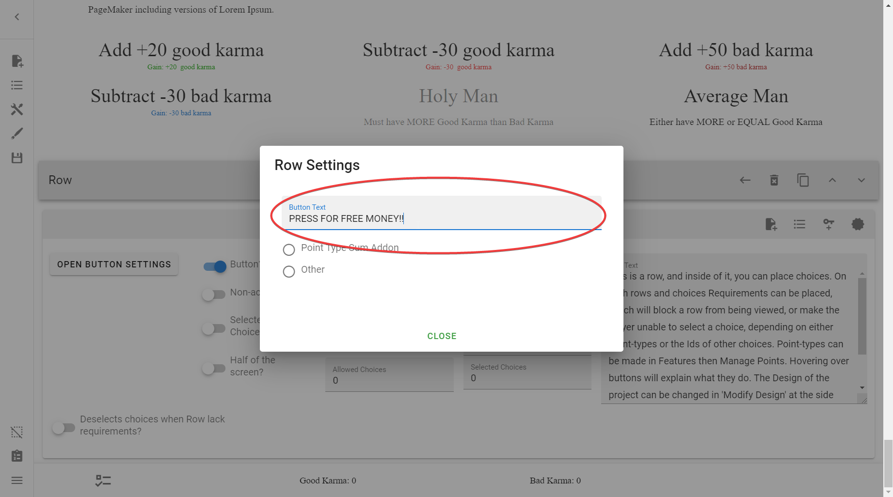

=== "Preview"

    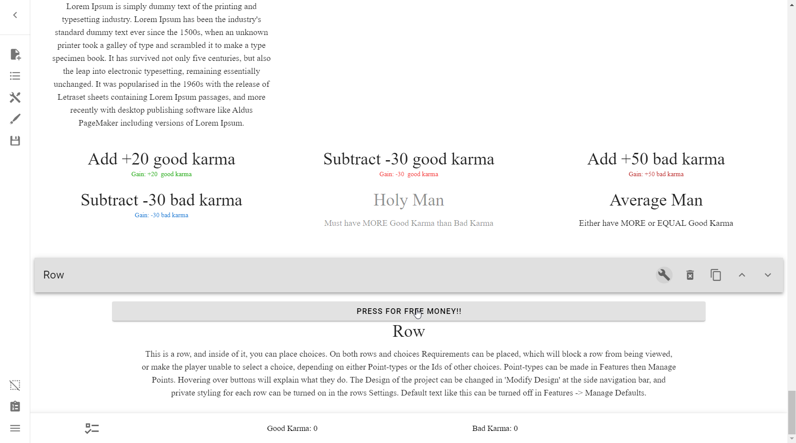

Now, your Button is still useless as it is. You change that by pressing either
**Point Type Sum Addon** or **Other**, which we'll cover next.

### Point Type Sum Addon
This, along with "Other" is one of two modes you can set your button to. This
button mode is concerned with adding a sum to a Point Type.

#### Button will add a sum to a Point-type
This switch only shows when you've selected the **Point Type Sum Addon** mode.
It is basically asking you to confirm your choice above.

Selecting it will yield more options:

##### Point-Type to use
This is a dropdown menu where you can select whichever Point Type you want to
add or subtract to.

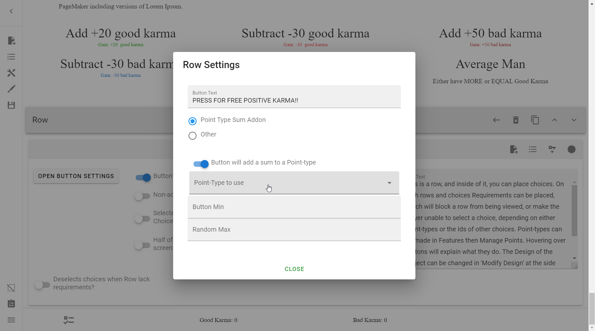

##### Button Min
If you just wanted to add a single static value, use the same value for both
this and the [Random Max](#random-max) field.

This is the value that will be added to your Point Type.

!!! danger

    Do **NOT** leave both of these fields empty. If you do, you will get a
    [NaN](/appendix/troubleshooting/#my-points-say-nan-instead-of-a-number)
    error in one of your Point Types.

Unlike [Scores](/mechanics/points-and-scores/#scores):

* If the integer is positive, this will be added
* If the integer is negative, this will be subtracted

!!! warning

    This button can be pressed over and over again, with no requirements
    stopping it. Be careful with this.

Here it is in action:

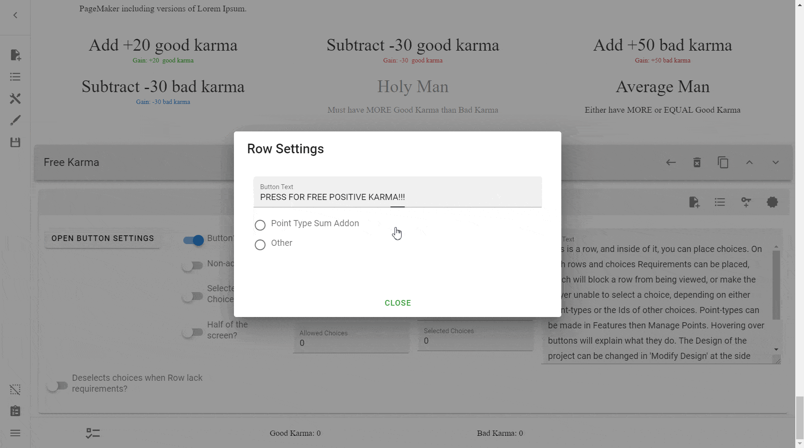

##### Random Max
If you wanted to generate a number between X and Y to add, then use this. The X
or minimum is what you would set the [Button Min](#button-min) to, and the Y or
maximum is what you would set this to.

!!! warning

    The Random Max is effectively **exclusive**. That means to generate a
    number between 1 and 10, you would need to set the Random Max to 11.

    !!! note

        The Creator is actually **inclusive** (includes the maximum number),
        but bugs whenever it is supposed to add the maximum points, meaning
        that sometimes the Button won't work at all.

        This means that the smaller the gap between the min and max, the higher
        the chance of generating the maximum number, and thus failing to add
        the amount to the Point Type.

!!! note

    If you set the Random Max to lower than the Button Min, the generated
    number will actually be taken away from the Point Type.

As an example, here is a button that adds a random number between 1 and 500:

!!! example ""

    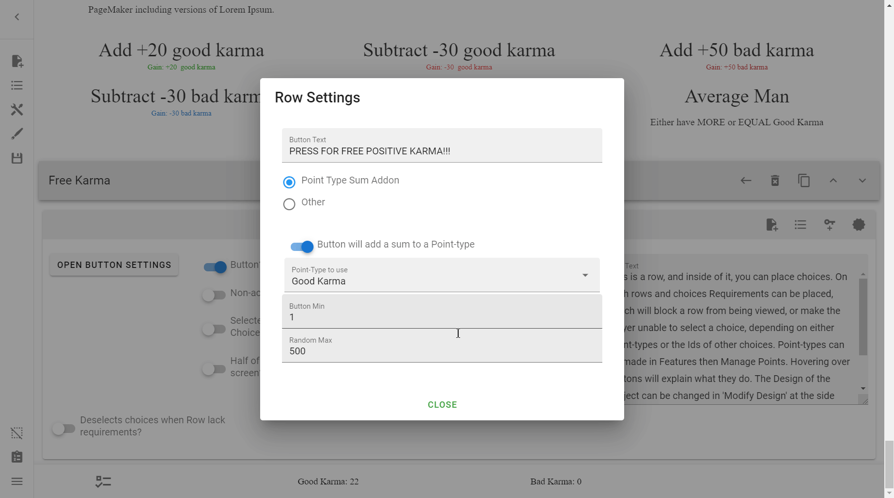

And an example of subtracting a value:

!!! example ""

    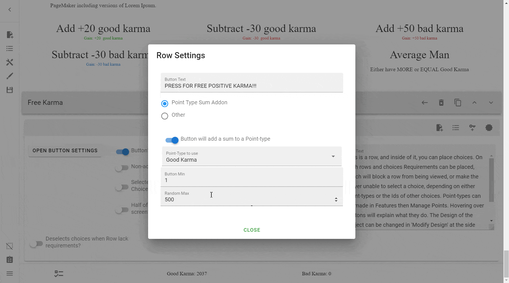

### Other
Choosing the Other mode will allow you to use a "Random" or a Variable". We'll
go into what this entails now.

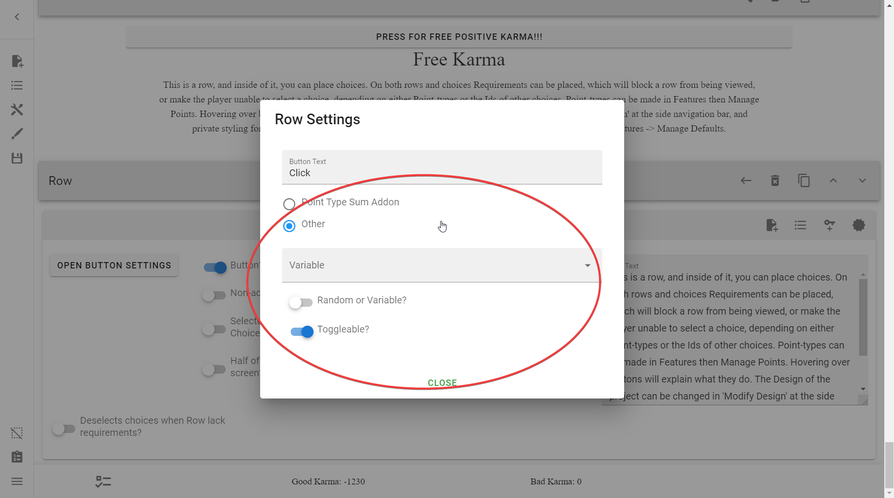

#### Variable
> "At this point, variables can only be used with button rows and can be
> attached to a button when it is created. Clicking a button with a variable
> attached to it will push the id of the variable into the array where the ids
> of selected choices lie. This makes it possible to use the id in requirements
> for rows and objects."
> 
> "Variables can currently only be used by adding them to
> buttons, which in turn can activate and deactivate them, and the variable-id
> can be used in requirements."
> 
> *– Interactive CYOA Creator*

When you first try use a Variable, you'll notice that there are none:

So we'll need to create a Variable.

##### Creating Variables
In order to create a Variable, you must go into **the Sidebar** →
**Open Features** → **Manage Variables**.

That will open this menu:

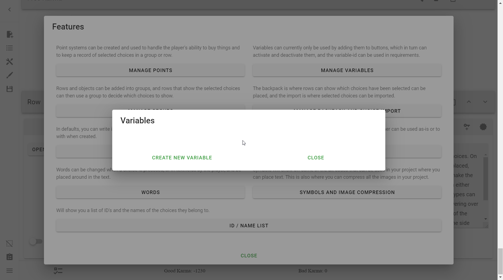

Then, simply press **Create New Variable**. Your new variable will be created:

You will notice three things:

1. **Id** – The [ID] for the variable.
2. **Status** – A value, either "true" or "false".
3. **Delete** – This will delete the Variable.

##### Id
This is the unique [ID] for the variable. You will use this interact with it,
such as using it Requirements.

##### Status
This is a Boolean value, representing either "true" or "false". This is what
Requirements check is true or not.

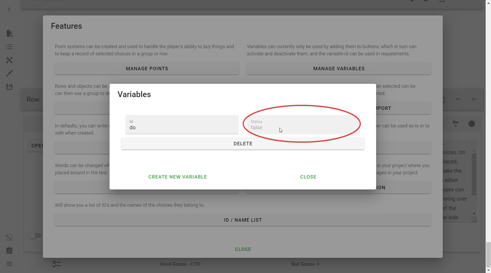

##### Deleting Variables
Simply press the **Delete** button in the [Variable menu](#creating-variables).

!!! warning

    This will not prompt and will instead immediately delete. Use caution when
    using this.

#### Random or variable?
This is, by default, off.

* When it is switched off, it uses a Variable.
* When it is switched on, it randomly selects a Choice.

#### Variable options

!!! note

    These only show if you've elected to use a Variable.

##### Toggleable?
This is, by default, on.

This means that pressing a button will turn `false` to `true` and `true` to
`false` and it could keep going on and on as long as the user is pressing the
Button.

If you turn this off, pressing the button once will switch the value, but it
only happens once; the button will be greyed out and can not be pressed again.

Here's an example of what it looks like with the option switched off:

!!! example

    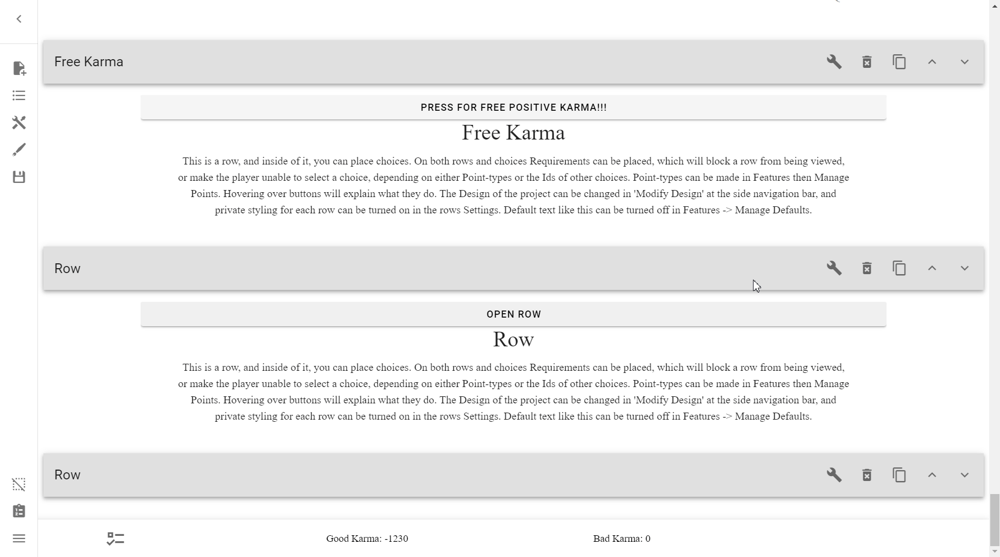

#### Random options
!!! note

    These only show if you've elected to use Random.

##### Uniform or weighted?
This switch allows you to decide between the Random options being picked
according to uniform/even distribution, or a weighted distribution.

In theory:

`Uniform distribution`

:   The chance that an entry is picked is the same for each entry in the set.
This is called *even distribution* or *uniform distribution*.

`Weighted random distribution`

:   Suppose we’re creating a question-answer game, and we want the questions
the user got wrong previously to appear more often than the question they
got right? This is called a *Weighted Random Distribution*, or sometimes
*Weighted Random Choice*.

In practice though, weighted distribution does not seem to have been
implemented, though it does still randomly picks choices.

##### Number of random choices that will be selected
!!! note

    This only appears if Uniform is switched on.

This option denotes how many Choices will be randomly selected.

!!! example

    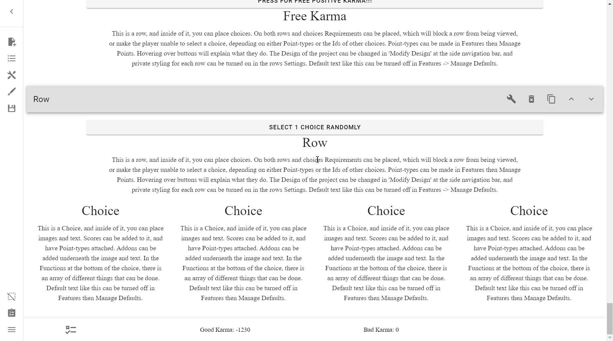

Do note, however, that like in the example, randomly selected Choices can
select already selected Choices, effectively unselecting them if the
[Only Unselected Choices?] switch isn't turn on.

[Only Unselected Choices?]: #only-unselected-choices

If you wanted to make sure that it selected Choices once and that is it,
turn on the [Button can only be pressed if no choice is selected?] switch. Note
that the [Toggleable] switch disappears when not using a Variable.

##### Only Unselected choices?
This option tells the Button that it should only select from unselected
Choices. This ensures that you do not unselect Choices from constant button
presses.

This doesn't apply when the
[Button can only be pressed if no choice is selected?] switch is selected,
because all of the Choices would be selected off by default.

This should allow the user to quickly fill up their Choices:

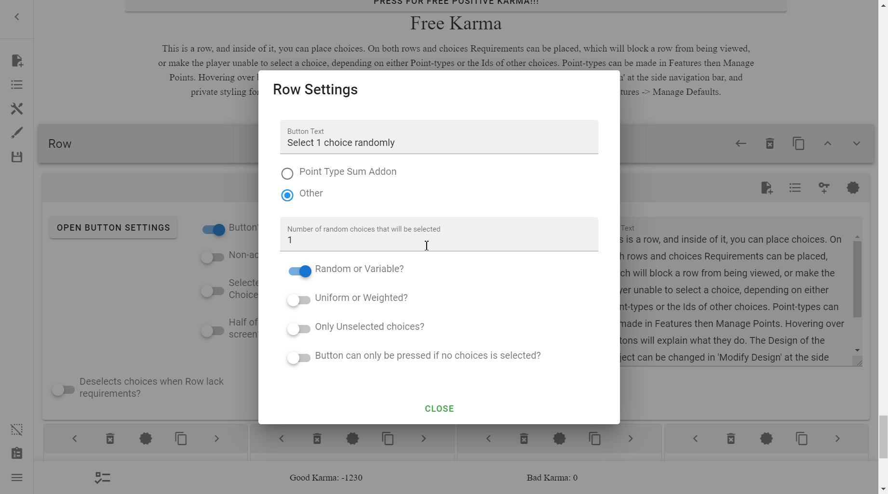

##### Button can only be pressed if no choice is selected?
This is equivalent to the [Toggleable] switch, meaning that once the button is
pressed, the Choices selected cannot be undone.

The difference being, unlike the [Toggleable] switch, if you unselect all of
the Choices you can press the Button again.

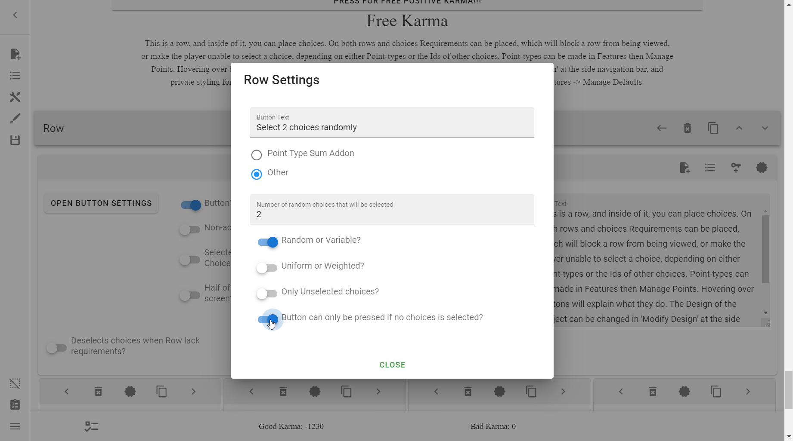

!!! example

    

---

Learn more about what you can do with Buttons and Variables in the [Reference].

<!-- URLs -->
[ID]: /mechanics/ids-and-requirements/#ids-unique-identifiers
[Reference]: /appendix/reference/#buttons-and-variables
[Button can only be pressed if no choice is selected?]: #button-can-only-be-pressed-if-no-choice-is-selected
[Toggleable]: #toggleable

<!-- BUFFER -->