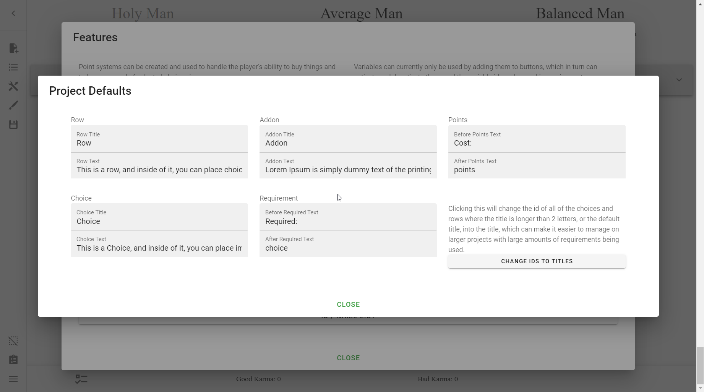

# Defaults
What are Defaults? They are the the default text that fills in titles and text
in objects such as Rows, Choices, and Addons.

> In defaults, you can write in default text that you want the choices and rows
> to be filled with when created.

To open the Defaults menu, go to **the Sidebar** → **Open Features** →
**Manage Defaults**. There you will see this screen:

Now you can decide what you want the default text for newly created Rows,
Choices, Addons, Requirements, and Points are. I usually make them blank, but
what you do with them is up to you.

## Change IDs to Titles
You'll notice something that doesn't quite belong in this section, the
**Change IDs to Titles** button.

!!! danger

    This is an irreversible manoeuvre, so make sure you save before doing this,
    just in case you decide you don't like the changes.

What does it do? Well the Creator says:

> Clicking this will change the id of all of the choices and rows where the
> title is longer than 2 letters, or the default title, into the title, which
> can make it easier to manage on larger projects with large amounts of
> requirements being used. 

Essentially, rather than [deciding an ID format for yourself][idf], it
automatically changes all objects' IDs to that of their title. I would **not**
recommend doing this, for three reasons:

1. It may mess up previous logic.
2. You have to keep reapplying this over and over, and before you apply any
   requirements, so that requirements are kept.
3. There may be ID clashes if more than one object has the same name.

Instead, you sould ascribe a personal [ID format][idf].

---

Learn more what you can do with Defaults in the [Reference].

<!-- URLs -->
[idf]: ../ids-and-requirements/#ids-unique-identifiers
[Reference]: /appendix/reference/#defaults