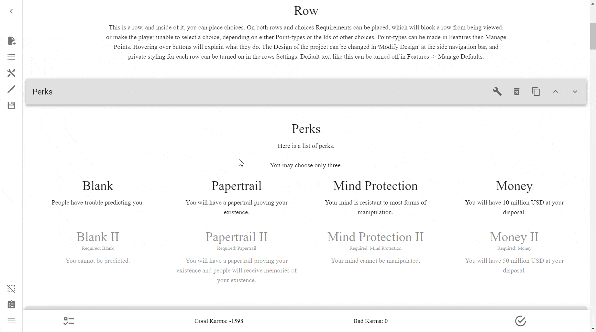

# Groups
Groups are special objects that can contain a number of other objects, acting
as categories or tags somewhat. Some elements of the ICC can use Groups to act
on all objects that belong to said Group.

## Creating Groups
To create a Group, simply go into **the Sidebar** → **Open Features** →
**Manage Groups** → **Create New Group**.

!!! example

    

## Adding Rows to Groups

## Adding Choices to Groups
To add a Choice to a group, simply go 