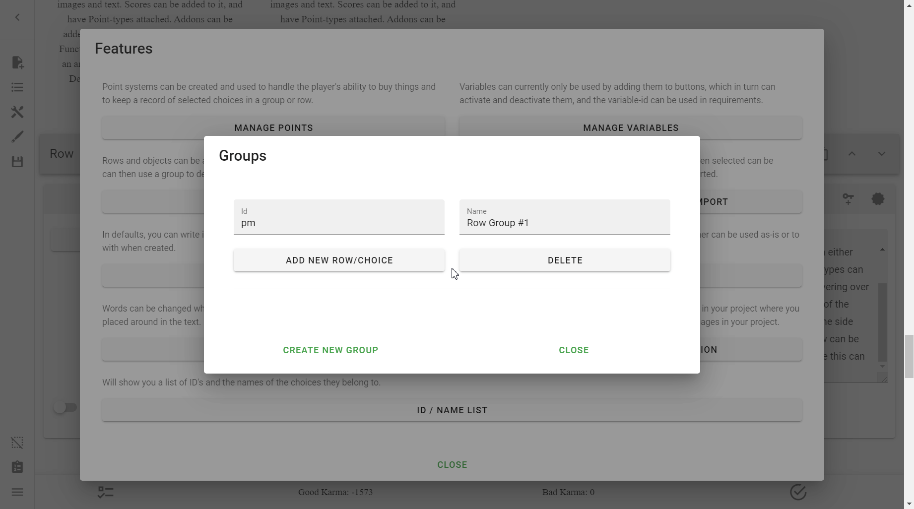
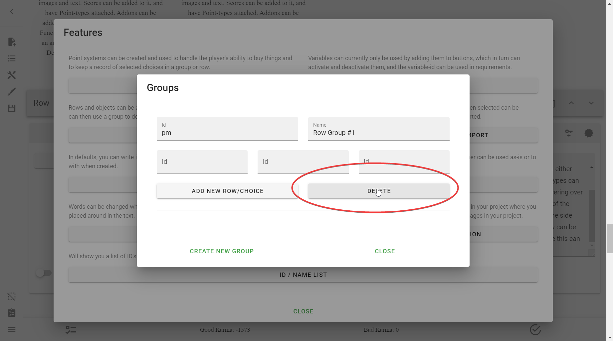

# Groups
Groups are special collections that can contain a number of Choices, acting as
categories or tags somewhat. Currently, they can only be used in the Row
setting [Selected Choices?].

[Selected Choices?]: /mechanics/rows/#selected-choices-from-group-id

## Creating Groups
To create a Group, simply go into **the Sidebar** → **Open Features** →
**Manage Groups** → **Create New Group**.

!!! example

    

## Deleting Groups
See [here](#delete).

## Group Menu
The Group Menu is pretty sparse, and that's because most of the Groups
functionality is done in the settings of the objects that are apart of the
Groups.

This is what the menu looks like:

### Id
This is the unique ID of the group.

You do not need to bother changing this, because when adding objects to a group
it will list out all the groups.

### Name
A very important setting, this is what the groups will be listed by. Make sure
to name this appropriately.

### Add New Row/Choice
!!! note

    Functionality for this button is not implemented fully. Do not use this.

This button dynamically creates input fields for IDs. This is presumably where
you would put the ID of a Row, Choice, or any other object you want in the
Group, however that is not how you actually add objects to a group.

Here is the button in action:

### Delete
!!! danger

    This **WILL** delete with warning. Be careful with this option.

This option will delete the Group.

## Adding All Choices in a Row to a Group
!!! note

    You can only add all of the Choices to **one** group only.

To add all of a Row's Choices to a Group, simply open up the **Row Settings**
and select any Groups from the **Group Membership** dropdown menu.

You can remove a Group by the *x* button.

## Adding Choices to Groups
!!! note

    You can add individual Choices to any number of Groups.

To add a Choice to a group, simply go into **Edit Row** → scroll to the Choice
you wanted to add to a Group → and press the key icon that *doesn't* have a
plus. It is labelled **Add To Group** on hover. Press that for as many times as
Groups you want this Choice added to.

## Reference

--8<-- "appendix/reference.md:groups"

<!-- URLs -->
[Reference]: /appendix/reference/#groups

<!-- BUFFER -->
