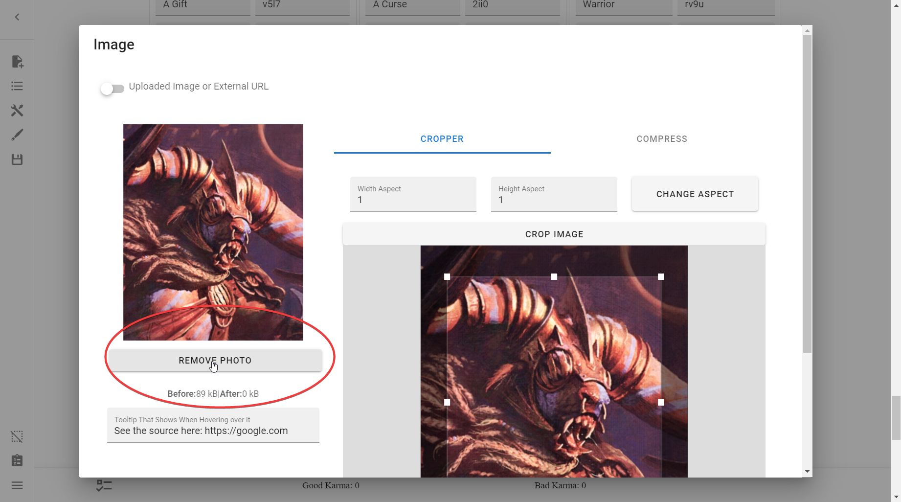
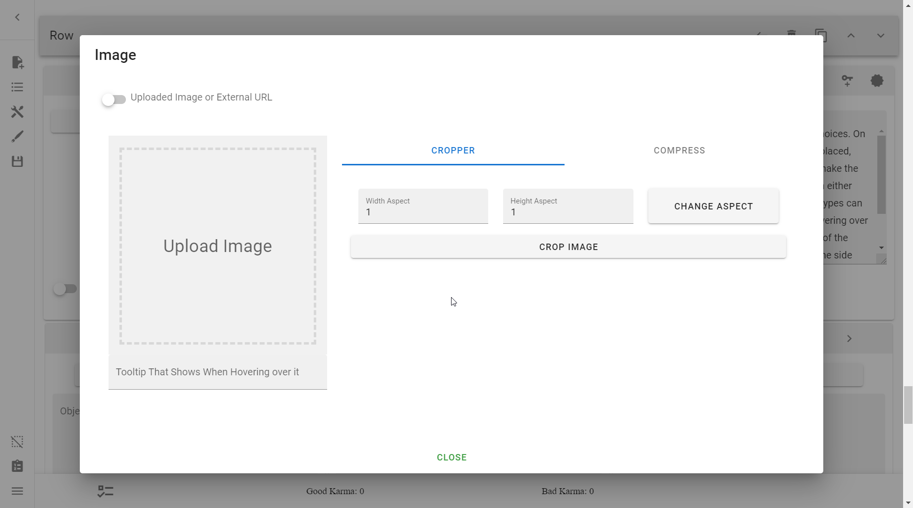
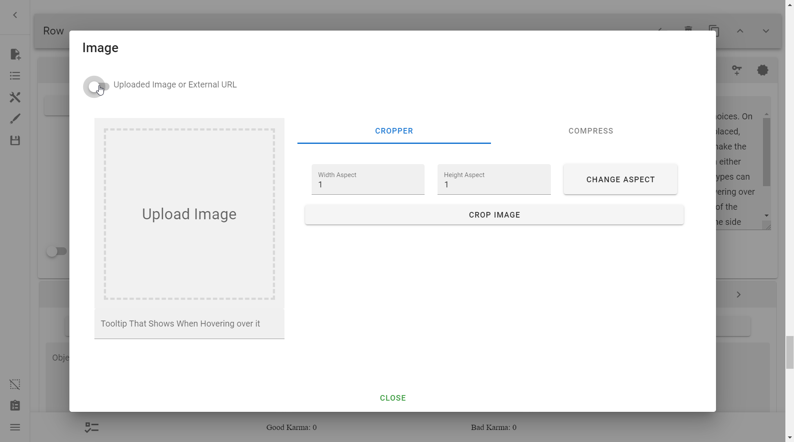
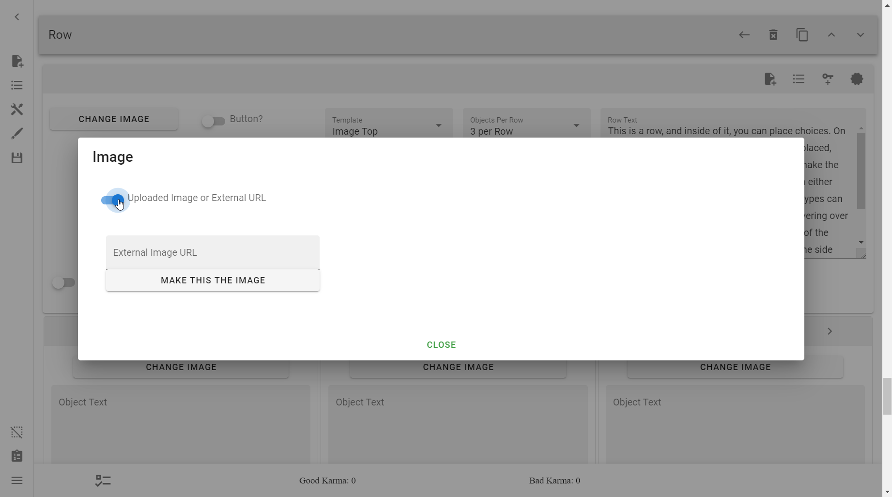
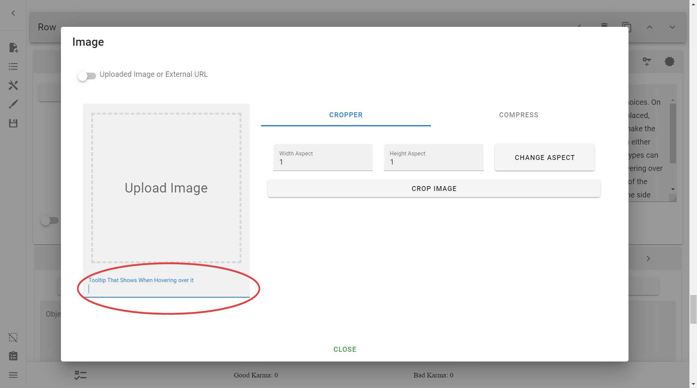
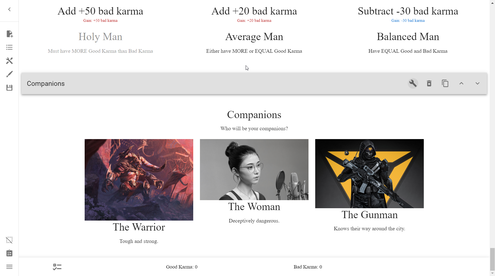
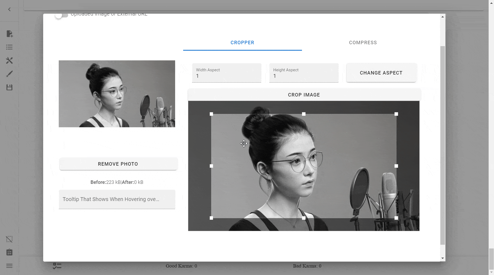
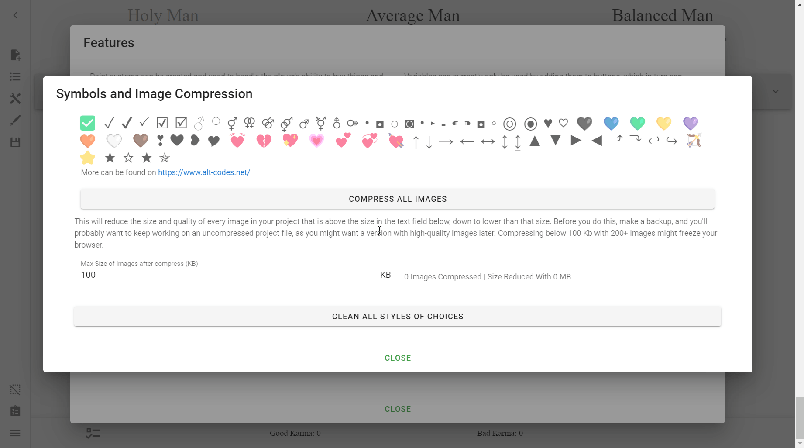
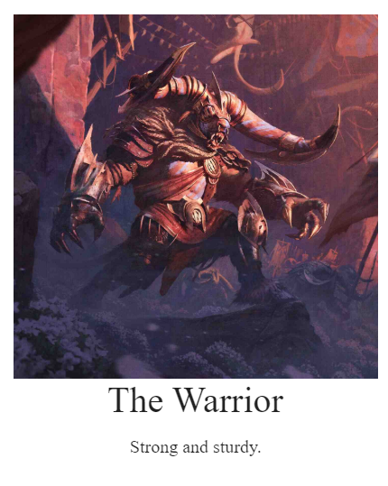

# Images
Images are quite easy to add in this Creator, and we'll be going through how to
insert them.

!!! tip

    It is advisable that you do not upload images until the core mechanics of 
    the CYOA are complete. The vast majority of space that an Interactive CYOA 
    takes up is due to images, and a huge amount of images will slow down lower
    end PCs. CYOAs over 300 MB are known to have caused issues such as crashes.

## Adding Images
To add an image to any compatible object, simply press the **Change Image**
button.

Don't worry about the Image Upload menu for now, we'll
[get into that later](#image-upload-menu).

The specifics for each compatible object and examples are detailed below.

### Adding to Rows
=== "Result (no styling)"

    

=== "Process"

    

### Adding to Choices
=== "Result (no styling)"

    

=== "Process"

    

### (TODO) Adding to Choices via Player Action
Players can upload their own images to a Choice if a Choice has that option
enabled. This can be useful in situations where you want a player to:

* Upload their looks, costume, appearance, etc
* Upload the looks of another character, such as a custom character they've
  created

And so on.

### Adding to Addons
=== "Result (no styling)"

    

=== "Process"

    

### (TODO LINK) Adding to Backgrounds
Adding images to the Background, Row Backgrounds, and Object Backgrounds is
covered in the [Styling](../styling/) section.

## Removing Images
To remove images, simply press the **Remove Photo** button.

!!! warning

    The creator does not warn you when removing photos, so remain cautious
    around the button.

## The Image Menu
This is the Image menu. It is where you will upload your images and assign them
to Rows, Choices, Addons, and so on.

### Uploaded Image or External URL
This switch allows you to switch between uploading the image yourself (directly
into the .json file) or using one already on the internet.

Why you would want to use one or the other is covered later
[here](#local-vs-external-images).

=== "Uploaded Image"

    

=== "External URL"

    

#### External Image URL
This only shows when the above switch is switched on. Put the URL of the
external image that you wanted to show here.

!!! note

    Unlike uploaded "local" images, external images cannot be altered. This
    means they cannot be cropped, compressed, nor have a tooltip.

### Tooltip That Shows When Hovering over it
This input field allows you to assign a
[tooltip](#tooltip-that-shows-when-hovering-over-it "like this!") on an image.

!!! tip

    If you wanted to give credit to artists' photos, here would be a great
    place to put it. That way, anyone wanting to know a specific image's artist
    would be able to tell the source of any image they hover over.

---

=== "Result"

    

=== "Process"

    

### Cropper
The **Cropper** section allows you to crop your photos.

To crop an image, simply drag the borders around and press the **Crop Image**
button at the very top.

You can zoom in and out of the image by using the scroll wheel on your mouse.

When zoomed in, move the crop placement by dragging on the inside of the
borders. Move the image by dragging on the outside of the borders.

You cannot, however, rotate images.

### Aspect Ratios
The **Width** and **Height Aspects** along with the **Change Aspect** button
allow you to change the Aspect Ratio of your images.

If you don't know what Aspect Ratios are, you can read about them
[here](https://en.wikipedia.org/wiki/Aspect_ratio_(image)).

These are useful for consistent image sizes between images used across the
CYOA.

!!! tip

    In order for a more uniform and orderly appearance, it is **highly**
    recommended you crop all of your images according to a specific
    aspect ratio and/or size.

    See the difference below:

    === "Cropped (1:1)"

        

    === "Full"

        

You can change the Aspect Ratio by inputting the desired Aspect Ratio in the
**Width** and **Height** fields, before pressing **Change Aspect**. Afterward,
crop the image as usual.

### Compress
Compressing images is very helpful if your CYOA is taking up too much space, as
the majority of space in the CYOA is taken up by local images.

You can switch to the Compress menu by pressing the **Compress** button up by
the **Cropper** button. These are tabs, and pressing one or the other allows
you to go back and forth.

!!! tip

    If you want an alternative compressor, check out [AvifCyoaCompressor]. It
    can compress projects down anywhere from 30-55%.

[AvifCyoaCompressor]: https://avif-cyoa-compressor.neocities.org/

!!! warning

    According to the Creator,
    **compressing will remove transparency from images.**

    This means:

    1. Do not use compression on images which need transparency.
    2. If you need to compress the entire project, don't forget to replace the
       transparent images afterward.

!!! warning

    The built-in compression will **not** compress Addon images. You will
    either need to do that manually, or use a tool[^lemmiwinkz].

[^lemmiwinkz]: Credit to discord user `lemmiwinkz` for this.

#### Compressing an Image
Compressing an image is simple. Press the **Compress Image** button. Before
that, however, you may wish to adjust the settings.

---

For these next two settings, keep an eye on the **After** file size on the
left.

##### Image Scale
The **Image Scale** field dictates how the resolution of the image will be
reduced.

##### Image Quality
The **Image Quality** field dictates how much the quality will be reduced
during the compression. The lowest option

* A value of `100` is (probably) the original quality
* A value of `90` is the default selection, and seems identical to the original

This option can go really low—saving a lot of space—before being super
noticeable on some images.

---

Ideally, you should strive for a balance between reducing the file size and
having the noticeability of the compression.

#### Compressing all Images
Compressing **all** images requires a different method, however. It is not
found in an individual image's settings, but rather in **Open Features** →
**Symbols and Image Compression**.

You should see this screen:

The field **Max Size of Images after compress (KB)** is the primary focus of
this section. Filling in this field allows you to set the maximum size of all
images in your ICYOA, compressing them to that size, regardless of the quality.

From the Creator:
> This will reduce the size and quality of every image in your project that is
> above the size in the text field below, down to lower than that size. Before
> you do this, make a backup, and you'll probably want to keep working on an
> uncompressed project file, as you might want a version with high-quality
> images later. Compressing below 100 Kb with 200+ images might freeze your
> browser.

To compress after setting this option, simply press **Compress All Images**.

---

An alternative method for compressing the entire project is by using Agregen's
[CYOA Compressor](https://agregen.gitlab.io/cyoa-compressor/). You could even
use the two methods in conjunction if truly need to. However, if you truly are
desperate to lower the size of your project, consider using
[external images](#external-images).

## Local vs External Images
### Local images
Local images are images they you have uploaded directly into the Creator. They
are the "Uploaded Images" above.

#### Exported Images
If you wanted to separate local images from the `project.json`, you can always
[export your project](/basics/#saveload-project).

### External images
External images are images they you have provided the Creator a link for.
Whenever someone plays your CYOA, it will download it from that site from their
computer.

---

There are pros and cons to using both local and external images. What you
choose should depend on your use case.

| Upload type        | Pros                                               | Cons                                                                                                                      | Use case                                   |
| ------------------ | -------------------------------------------------- | ------------------------------------------------------------------------------------------------------------------------- | ------------------------------------------ |
| **Local**          | + Faster + More reliable + Can be altered  | - Takes up space (too much space can crash the creator, and most free website hosts limit how much space you can use)     | Smaller projects (<100 MB)                 |
| **Exported local** | + Same as Local + Keeps your project.json down | - Same as local - Harder to recover if the images are deleted                                                         | Larger small projects (>50 MB but <100 MB) |
| **External**       | + You keep the size of your project.json down      | - Slower - You have to trust the servers won't delete the image - Unable to be altered (cropped, compressed, etc) | Larger projects (>100 MB)                  |

!!! tip

    You do not have to commit to one or the other. Sometimes, it's enough to
    just externally host large images and keep the rest locally.

### Image host sites
Here are a list of sites that you can host your external images on. Feel free
to provide suggestions in the comments below.

!!! warning 

    Keep in mind that your images should follow a host's terms and conditions
    in order to not have the image removed.

    This means be extra cautious when uploading NSFW images. If you can, prefer
    to keep them local. If you absolutely cannot, pick a host that allows
    NSFW images.

Public:

* [Imgur](https://imgur.com) – No NSFW allowed

Private:

* [Discord](https://discord.com) (open image preview → Open in Browser to get 
the link)

## Template / Image Position
The **Template** dropdown menu is how you can decide where to place your Images
relative to your Choices.

* **Image Top:** This is the default position. Images will be placed on top of
  the choice.
* **Image left:** Images will be placed to the left.
* **Image right:** Images will be placed to the right.

=== "Image Top (Default)"

    

=== "Image Left"

    

=== "Image Right"

    

## Reference

--8<-- "appendix/reference.md:images"

<!-- URLs -->
[Reference]: /appendix/reference/#images
