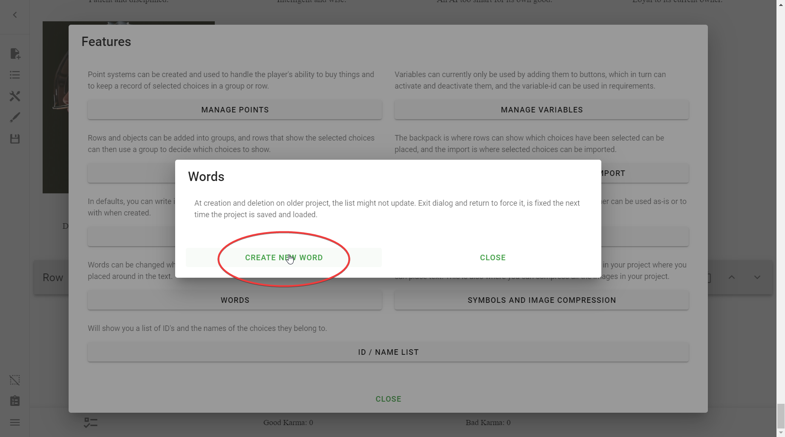
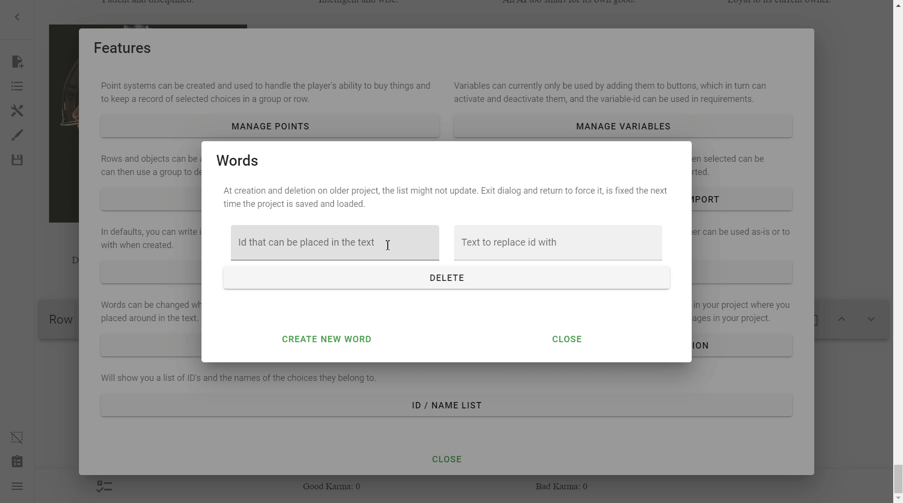

# Words
**Words** are special placeholder variables (not to be confused with
[Variables]) that can be placed within any body of text in the Interactive
CYOA. When used, they will be changed into whatever value they hold.

[Variables]: /mechanics/buttons-and-variables/

<!-- Corrected spelling of this quote, which had three s's in `pressed` -->
> Words can be changed when a choice is pressed, or in textfields by the
> player, and be placed around in the text.

!!! note

    Having too many Words is a good way to make your CYOA sluggish. Don't go
    too heavy on Words[^1].

## Words Menu
To open the Words menu, simply go to **the Sidebar** → **Open Features** →
**Words**.

You will arrive at this screen:

## Creating Words
To create a Word is very simple, just press **Create New Word:**

And our new word is created:

## Deleting Words
Deleting words is very simple, just press **Delete**.

## Settings
These are the individual fields that will adjust how you use Words.

### Id that can be placed in the text
This is the Word's ID. By putting that anywhere in a body of text (such as,
say, a Choice Text or Row Text), the program will automatically replace it with
its **value**.

Typically, Word IDs start with `#`, but they don't have to.

### Text to replace id with
This is the **value** of the Word. This is what the ID is replaced with.

If, for example, I had a variable named `#favourite_game`, and I wanted the
Text that would replace it to be `Minecraft`, I could put this in a Row text:

> What is your favourite game? Mine is #favourite_game!

and it would appear as:

> What is your favourite game? Mine is Minecraft!

!!! example "Here's a live demonstration"

    

## Reference

--8<-- "appendix/reference.md:words"

<!-- Footnotes -->
[^1]: Credit to `lord_valmar` on Discord for this tip

<!-- URLs -->
[Reference]: /appendix/reference/#words
