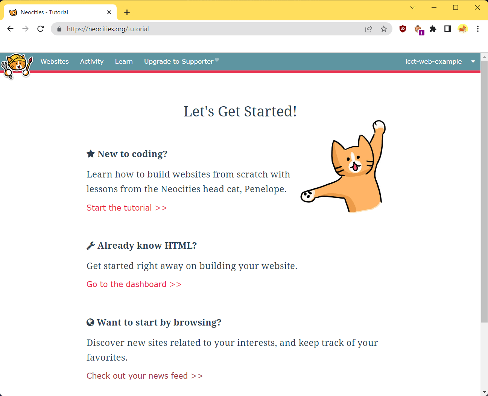
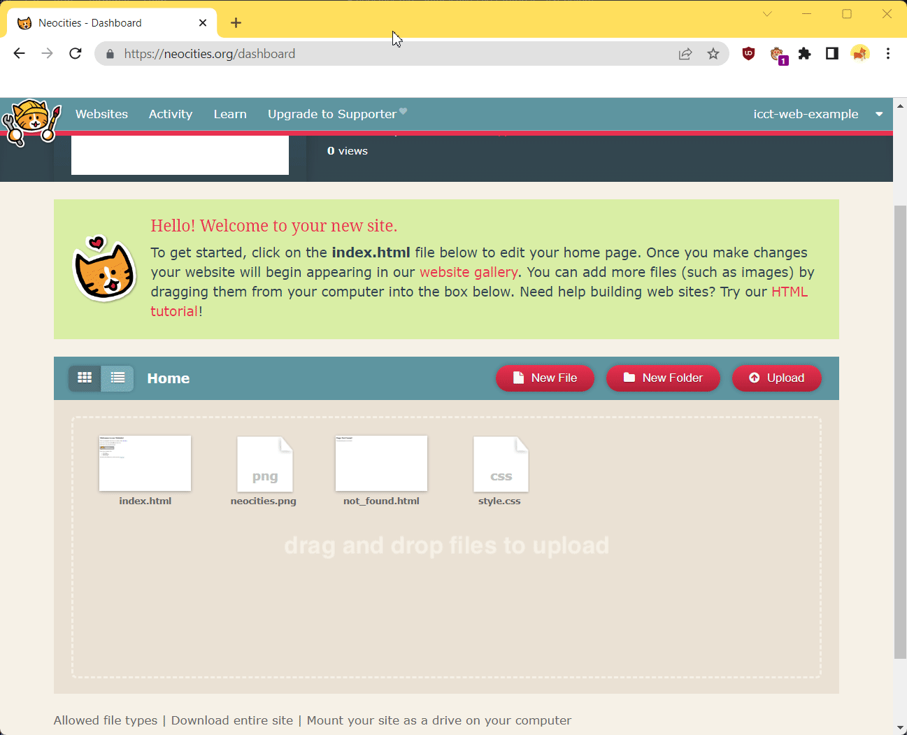

# Publishing on Neocities
To help you through this tutorial, we will start completely from scratch and
show you how to create an account, upload your CYOA, and get it working.

<!-- There will also be a video guide at the end. -->
<!-- ^ Maybe not, it's simple enough to understand -->

## Limits
Before committing to Neocities it's important that you understand its
limitations in case it is not the right use case for you. If what you require
falls outside of these limits, consider becoming a Neocities Supporter, or
choosing another host.

Neocities's [limits] for a Free account are as follows:

* 1 GB storage – Some CYOAs get as large as hundreds of megabytes if they
  aren't using external URLs
* 200 GB bandwidth – How much traffic can visit your site (i.e., how much all
  visitors can download, including image files)

    !!! note

        This is a soft limit. Temporary surges are fine, [Neocities] won't
        take your site down automatically, and [they're] very flexible.

* File Upload Type restrictions
    * You can only upload the following file types: 
        * HTML (.html, .htm)
        * Image (.jpg, .png, .gif, .svg, .ico)
        * Markdown (.md, .markdown)
        * JavaScript (.js, .json, .geojson)
        * CSS (.css)
        * Text (.txt, .text, .csv, .tsv)
        * XML (.xml)
        * Web Fonts (.eot, .ttf, .woff, .woff2, .svg)
        
        ??? info "Full list"
        
            asc atom avif bin css csv dae eot epub geojson gif gltf gpg
            htm html ico jpeg jpg js json key kml knowl less manifest map
            markdown md mf mid midi mtl obj opml otf pdf pgp png rdf
            resolveHandle rss sass scss svg text tsv ttf txt webapp webmanifest
            webp woff woff2 xcf xml

    * More information is available here:
      [https://neocities.org/site_files/allowed_types][nc-allowed-file-types]

* Can only create a single website per account
    
    !!! note
    
        Creating multiple accounts isn't disallowed! Though it can be a pain to
        sign in and out

[limits]: https://neocities.org/supporter
[nc-allowed-file-types]: https://neocities.org/site_files/allowed_types

## Using the Web
The easiest and most beginner-friendly way is to sign up and upload your site
through Neocities in the browser.

First thing's first, navigate to the website:
[https://neocities.org/](https://neocities.org/)

You should see this screen:

Now sign up with your credentials, bearing in mind that your **Username** will
be your subdomain. So if your username was "epicradcool", your site would be
hosted at
[https://epicradcool.neocities.org/](https://epicradcool.neocities.org/).

You will be asked to verify your email, make sure you do that.

Now you will come upon this page:

If you wanted to learn about HTML, feel free to peruse that tutorial. When
you're done, come back to this page and continue where you left off.

Next, click **Go to the Dashboard >>**.

### The Dashboard
The Dashboard is a place you will quickly become very familiar with. It is
where you will edit, upload, and update the files containing your CYOA.

This is the Dashboard:

You are now in your _root_ directory. This is the very top of your website. Any
files you place in this folder is accessible by going to
`https://your-site.neocities.org/a_file.png`.

As you can see from the image, you can create new files and folders by pressing
the button. That's not what we're interested in; we're not looking to create
files or folders (at least, not at this point in the tutorial), we're looking
to upload our already created `project.json`.

## Uploading your files
There are two ways you can upload from the browser:

1. Press the **Upload** button – This cannot handle uploading files AND folders
2. Drag and drop the files in

Now we're going to upload our files. First, upload your `project.json`:

Next, upload the [Viewer](/static/viewer/) here. This is the code that actually
interprets your `project.json` and displays it to players.

!!! warning

    Neocities is tricky in that it can only upload one directory at a time. You
    will have to check that both the `css/` and `js/` folders are there, and
    that all of the files are contained in them.

    Also check that `index.html` was replaced if it previously existed.

After that, you're done! View your CYOA live at the link at the top of your
Dashboard. Easy, right?

## Using the CLI
!!! note

    This is for more intermediate to advanced users who are familiar with the
    command line. You can learn, of course, but it may be difficult to begin
    with.

Please see the relevant information here:
[https://neocities.org/cli](https://neocities.org/cli)

## Migrating from Neocities
At the bottom of [the Dashboard](#the-dashboard) there is a button entitled
**Download entire site**. Use that to, well, download your site.

<!-- URLs -->
[no-load]: /appendix/troubleshooting/#ive-uploaded-my-site-to-neocities-but-it-wont-load

<!-- BUFFER -->