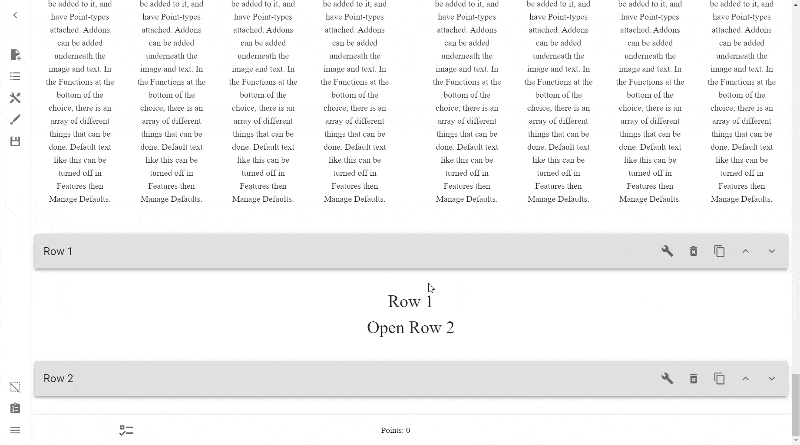
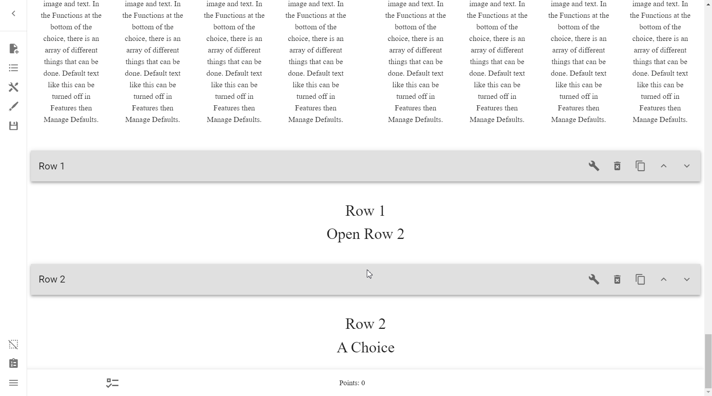
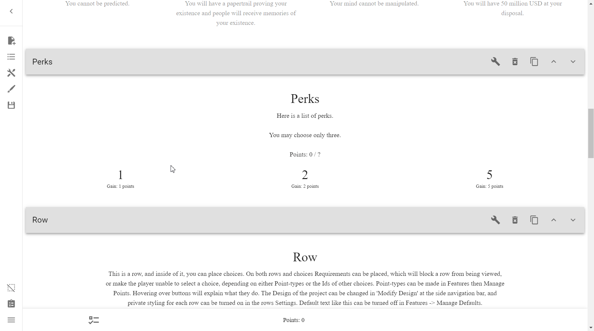

# Reference
This is the reference for Interactive CYOA creators. 

While the rest of the tutorial focuses on individual concepts within the
creator, this section focuses on real issues and desired outcomes, and walks
you through how to achieve it.

## Creator
### Zoom in and out
As the desktop application is an Electron app, it is functionally just a
website that runs in its own web browser. Because of this, you can zoom in
and out of the desktop app by doing ++ctrl+plus++ (++ctrl+shift+equal++) to 
zoom in, and ++ctrl+minus++ to zoom out.

## Whole CYOA
### Changing the page title
In order to change the title of the tab in the browser, simply edit
`index.html`.

Look for:
```html
<title>CYOA</title>
```
and replace "CYOA" with whatever you want the title to be.

One title format is `{CYOA name}: Interactive`, but whatever works for you is
fine.

### Changing the page icon
Changing the icon of the page's tab is simple, all you need to do is add the
following code to your `index.html` file, just below the `<title>` tag:

```html
<link rel="icon" href="/link/to/icon.jpg">
```

### Table of Contents / Tab Menu

### Show a loading progress indicator
See [here](../extending-your-cyoa/#progress-indicator).

## Text
### Make specific text a different colour
To do this, simply use inline CSS styling between HTML tags.

For example, this:

```html
<span style="color: #ba2323;">makes the text red.</span>
```

<span style="color: #ba2323;">makes the text red.</span>

!!! note

    Colour in CSS is set in a variety of different ways, such as by a hex code
    or RGB values.

    To learn more, see
    [CSS Legal Color Values] and [CSS Colors].

    If you need help selecting a value, see
    [Color Picker](https://htmlcolorcodes.com/color-picker/) for a simple
    colour picker, or [Color Wheel](https://color.adobe.com/create/color-wheel)
    to easily create complementary colour palettes.

### Add hyperlinks to your CYOA
!!! note

    Credit to [Om1cr0n](https://wormlewdmod.neocities.org/about) for this code.

In your project's `js` folder, replace `app.c533aa25.js` with the one from
[here](../static/fixed-app/app.c533aa25.js). It's a fixed version that doesn't
santize `href` tags in the HTML.

After that, add hyperlinks as normal:

=== "Open in a new window"

    ```html
    Press <a href="https://example.com" target="_blank">here</a> for more information.
    ```

    New Window Demo:
    
    Press <a href="https://example.com" target="_blank">here</a> for more
    information.

=== "Open in current window"

    ```html
    Press <a href="https://example.com">here</a> for more information.
    ```

    Current Window Demo:

    Press <a href="https://example.com">here</a> for more information.

??? note "How it works"

    How does this work? Well, in the original `app.c533aa25.js` the author made
    it so that only specfic html tags and attributed were allowed, and anything
    else would be "sanitized" (removed).

    We can take a deeper look if we run a `git diff` on the two files:

    ```diff
    diff --git a/pretty_app.js b/pretty_app.js
    index 6d6a7a6..1d8323a 100644
    --- a/pretty_app.js
    +++ b/pretty_app.js
    @@ -1008,8 +1008,10 @@
            data: function () {
            return {
                sanitizeArg: {
    -              allowedTags: ["address", "article", "aside", "footer", "header", "h1", "h2", "h3", "h4", "h5", "h6", "hgroup", "main", "nav", "section", "blockquote", "dd", "div", "dl", "dt", "figcaption", "figure", "hr", "li", "main", "ol", "p", "pre", "ul", "a", "abbr", "b", "bdi", "bdo", "br", "cite", "code", "data", "dfn", "em", "i", "kbd", "mark", "q", "rb", "rp", "rt", "rtc", "ruby", "s", "samp", "small", "span", "strong", "sub", "sup", "time", "u", "var", "wbr", "caption", "col", "colgroup", "table", "tbody", "td", "tfoot", "th", "thead", "tr"],
    +              allowedTags: ["img", "address", "article", "aside", "footer", "header", "h1", "h2", "h3", "h4", "h5", "h6", "hgroup", "main", "nav", "section", "blockquote", "dd", "div", "dl", "dt", "figcaption", "figure", "hr", "li", "main", "ol", "p", "pre", "ul", "a", "abbr", "b", "bdi", "bdo", "br", "cite", "code", "data", "dfn", "em", "i", "kbd", "mark", "q", "rb", "rp", "rt", "rtc", "ruby", "s", "samp", "small", "span", "strong", "sub", "sup", "time", "u", "var", "wbr", "caption", "col", "colgroup", "table", "tbody", "td", "tfoot", "th", "thead", "tr"],
                allowedAttributes: {
    +                a: ["href", "target", "rel"],
    +                img: ["src"],
                    p: ["style"],
                    b: ["style"],
                    span: ["style"],
    @@ -1018,6 +1020,7 @@
                allowedStyles: {
                    "*": {
                    color: [/^#(0x)?[0-9a-f]+$/i, /^[A-Za-z]+$/, /^rgb\(\s*(\d{1,3})\s*,\s*(\d{1,3})\s*,\s*(\d{1,3})\s*\)$/],
    +                  content: [/^.*$/],
                    "text-align": [/^left$/, /^right$/, /^center$/],
                    "font-size": [/^\d+(?:px|em|%)$/]
                    },
    @@ -1191,6 +1194,7 @@
                sanitizeArg: {
                allowedTags: ["address", "article", "aside", "footer", "header", "h1", "h2", "h3", "h4", "h5", "h6", "hgroup", "main", "nav", "section", "blockquote", "dd", "div", "dl", "dt", "figcaption", "figure", "hr", "li", "main", "ol", "p", "pre", "ul", "a", "abbr", "b", "bdi", "bdo", "br", "cite", "code", "data", "dfn", "em", "i", "kbd", "mark", "q", "rb", "rp", "rt", "rtc", "ruby", "s", "samp", "small", "span", "strong", "sub", "sup", "time", "u", "var", "wbr", "caption", "col", "colgroup", "table", "tbody", "td", "tfoot", "th", "thead", "tr"],
                allowedAttributes: {
    +                a: ["href", "target", "rel"],
                    p: ["style"],
                    b: ["style"],
                    span: ["style"],
    @@ -1756,6 +1760,7 @@
                sanitizeArg: {
                allowedTags: ["address", "article", "aside", "footer", "header", "h1", "h2", "h3", "h4", "h5", "h6", "hgroup", "main", "nav", "section", "blockquote", "dd", "div", "dl", "dt", "figcaption", "figure", "hr", "li", "main", "ol", "p", "pre", "ul", "a", "abbr", "b", "bdi", "bdo", "br", "cite", "code", "data", "dfn", "em", "i", "kbd", "mark", "q", "rb", "rp", "rt", "rtc", "ruby", "s", "samp", "small", "span", "strong", "sub", "sup", "time", "u", "var", "wbr", "caption", "col", "colgroup", "table", "tbody", "td", "tfoot", "th", "thead", "tr"],
                allowedAttributes: {
    +                a: ["href", "target", "rel"],
                    p: ["style"],
                    b: ["style"],
                    span: ["style"],
    @@ -2215,6 +2220,7 @@
                sanitizeArg: {
                allowedTags: ["address", "article", "aside", "footer", "header", "h1", "h2", "h3", "h4", "h5", "h6", "hgroup", "main", "nav", "section", "blockquote", "dd", "div", "dl", "dt", "figcaption", "figure", "hr", "li", "main", "ol", "p", "pre", "ul", "a", "abbr", "b", "bdi", "bdo", "br", "cite", "code", "data", "dfn", "em", "i", "kbd", "mark", "q", "rb", "rp", "rt", "rtc", "ruby", "s", "samp", "small", "span", "strong", "sub", "sup", "time", "u", "var", "wbr", "caption", "col", "colgroup", "table", "tbody", "td", "tfoot", "th", "thead", "tr"],
                allowedAttributes: {
    +                a: ["href", "target", "rel"],
                    p: ["style"],
                    b: ["style"],
                    span: ["style"],
    ```

    Here we can see that the new `app.c533aa25.js` file simply adds an
    exception for `<a>` tags and the `href` attribute, allowing for
    hyperlinking.

## Rows
### Make a row invisible
If you want to make a Row invisible, simply add a [Selected Choice]
requirement, but simply don't put any ID in its place. This will permanently
collapse the Row.

Alternatively, put an ID in there that is guaranteed not to get picked, such as
`MAKE_ME_INVISIBLE`.

### Hiding Rows via Selected Choice
Rows can be hidden by using the **Add Selected Choice** requirement. In order
to open a Row, you would need to select a choice.

!!! tip

    Doing this is **highly** recommended when an ICYOA becomes long enough.

    This can be used to create a 'Tabs' / Table of Contents menu, which is gone
    into more detail about [here](../../reference/#table-of-contents-tab-menu).

=== "After"

    

=== "Before"

    

=== "Process"

    

!!! warning

    If you decide to delete a requirement by removing its text, you may notice
    that the Row—even though the requirement is empty—does not show. Make sure
    to press **DELETE** underneath the **Selected Id** input to get the Row
    working as intended again.

    This can, however, be used on purpose, in order to
    [make a Row invisible](../../reference/#make-a-row-invisible).

Now, of course, you do not need to use **Selected Choice** to hide rows, and
can use any number of requirements. It is, however, the most common
requirement to use.

#### Nested Rows
While nested Rows can be useful, especially for long ICYOAs which require a
**lot** of scrolling, there can be a couple of downsides.

1. Nesting more than 2 down levels can lead users to be confused and annoyed as
    to where certain sections are.
2. If Nested Rows are not set up properly, they can leave Orphaned Rows.

Orphaned Rows occur when a chain of Nested Rows aren't set up so that closing
the topmost parent Row closes not just any Rows that depend on it, but also
Rows that depend on the topmost Row's dependent, and so on and so forth.

To do this, use [Selected Choice][sc] requirements for each nesting level.

=== "After"

    

=== "Before"

    

=== "Process"

    

[u/Traveller-81] goes into more detail here:

??? quote "Tips and Pitfalls for Interactive CYOA Creators (Reddit)"

    The third common pitfall is row nesting, specifically how NOT to do it. Now
    nesting rows in and of itself isn't a bad thing. It prevents having to
    scroll through hundreds of choices to find the section you want (one of the
    few design flaws of the WoW ICYOA listed above). Instead, you design the 
    various rows to only show when the prerequisite choice is active, basically
    showing up at the push of a button. Nesting rows occurs when the button for
    a row is inside another row, which can be inside another row, and so on. 
    Overusing this can lead to your users being confused and annoyed, having to
    search through nested row after nested row to find the section they want.
    Not fun. Finding the right balance between "ALL THE CHOICES" and "Where the
    hell is it!" is important.

    Another problem with nested rows is avoiding orphaned rows. Orphaned rows 
    occur when attempting to close multiple levels of nested rows by closing
    the top row leaves the lower rows still visible. This is an annoying design
    flaw that forces your users to close nested rows in order, every time.

    What's worse is if the button for a nested row is a choice you want to
    keep, leaving you unable to close the orphan row without screwing up your 
    build. This is both aggravating and very unprofessional. To counteract
    this, require all your nested rows to need all previous levels active to 
    appear. Thus, if you close an upper level, it will close all lower levels.
    This does become slightly tedious to code the deeper a nested row is,
    however.[^1]

#### Combining Multiple Requirements
Chaining multiple requirements onto one object means that you require all of
those requirements in order to allow the object to be chosen or shown.

!!! note

    You can use multiple requirements and scoring to make discounts on options.

    An example of this logic in pseudocode would be:
    
    * "If this choice that gives a discount is selected, then it costs 5
        points"
    * "If this choice that gives a discount is not selected, then it costs
        10 points"

    You can learn more [here](../../reference/#making-discounts).

#### Nesting Multiple Requirements
Nesting multiple requirements means to apply requirements onto requirements
themselves. This type of advanced behaviour can get quite unwieldy.

## Choices
### You may only pick X options
See [here](../mechanics/rows/#allowed-choices).

### Choice requires anothers Choice
See [here][choice_requires_another_choice]

### Hide a choice if it doesn't meet the requirements
Simply use filters.
<!-- Elaborate, use examples, and link to Styling page when its done -->

### Disabled Choices via Selected Choice
If you have some choices that have prerequisites/requirements, then having
them require those requirements will enforce that users don't cheat, and 
follow the rules.

#### Making Choices Invisible
Choices that don't have their requirements can be made invisible using filters.

!!! tip
    
    !!! warning

        Before you use private styling, make sure you've read and understood
        [this](../../styling/#important-advice).
    
    Unless your CYOA constantly and consistently wants to hide every choice
    that doesn't have its 

## IDs
### Navigation with ID / Title list
ID / Title list as helpful way of navigating your way through a large CYOA –
showcase JRPG Traitor 

Using the [See ID/Title List] option in [the Sidebar] allows you to quickly
navigate through your CYOA.

### Reusing IDs
Interesting fact: Setting multiple things to the same ID allows you to activate
one through the other 

## Requirements
### Logic Gates and Requirements
| Logic Gate | Explanation                                     | Requirement |
| ---------- | ----------------------------------------------- | ----------- |
| **AND**    | True only if all IDs are selected               | [GOTO][AND] |
| **OR**     | True if at least one ID is selected             | [GOTO][OR]  |
| **NOT**    | True if an ID is not selected                   | [GOTO][NOT] |
| **NOR**    | True when all IDs are not selected              | [GOTO][NOR] |
| **NAND**   | True unless all IDs are selected                |             |
| **XAND**   | True if all IDs are either selected or not      |             |
| **XOR**    | True if one ID is selected and the other is not |             |


### 'All of these are selected' requirement
There is no such requirement within the ICC at this moment. To emulate it,
however, is simple. Just add more than one [Selected Choice] requirement,
and it will ensure that you have each and every one selected.

### 'None of these are selected' requirement
As above, simply add a [Non-selected Choice][NOT] requirement for each ID that 
must not be selected.

### 'Not all of these are selected' requirement
Functioning as a NAND gate.

<!-- TODO -->

### 'All of these are either selected or non-selected' requirement
Functioning as a XAND gate.

<!-- TODO -->

### 'One of these is selected and another is non-selected' requirement
Functioning as a XOR gate.

<!-- TODO -->

## Points and Scoring

### Making discounts
<!-- TODO -->

## Images

## Defaults

## Addons

## Copying

## Words
### Dynamically display Points inside a Row, Choice, or Addon
This is useful if you wanted to remind the user how many points they have,
and may be useful if you don't desire to have a Points Bar.

To achieve this, simply go into Open Features --> Words, and create a Word
using the ID of your Point type.

!!! warning

    Make sure that your Word ID and Point-type ID are **EXACTLY** the same.
    
    For example, if your Point-type ID was `perks` and your Word ID was
    `#perks`, you would need to change your Point-type ID to `#perks` or
    vice-versa.

    !!! tip

        You should keep the format of `#{point_name}` because it makes it
        easier to differentiate between points that are dynamically inserted
        or not.

        It also makes it easier to see when editing text that something is
        meant to be inserted there.

!!! quote "From the 30.8.2022 Changelog"

    Changed words so that the sum of a point type can be shown in the text, on
    rows, choices, and add-ons. To do this, the id of the point-type should be
    pretty unique, and be identical to the id of the Word.

=== "Outcome"

    

=== "Setup"

    

## Buttons

## Variables

## Groups

<!-- References -->
[^1]: [Tips and Pitfalls for Interactive CYOA Creators (Reddit)](https://www.reddit.com/r/InteractiveCYOA/comments/wrf0hl/tips_and_pitfalls_for_interactive_cyoa_creators/)

<!-- URLs -->
[Selected Choice]: ../mechanics/ids-and-requirements/#selected-choice
[AND]: ./#all-of-these-are-selected-requirement
[OR]: ../mechanics/ids-and-requirements/#one-of-these-is-selected-requirement
[NOT]: ../mechanics/ids-and-requirements/#non-selected-choice
[NOR]: ./#none-of-these-are-selected-requirement
[choice_requires_another_choice]: ../mechanics/ids-and-requirements/#disabled-choices-via-selected-choice
[CSS Legal Color Values]: https://www.w3schools.com/cssref/css_colors_legal.php
[CSS Colors]: https://www.w3schools.com/cssref/css_colors.php
[See ID/Title List]: ../basics/#see-idtitle-list
[the Sidebar]: ../basics/#the-sidebar