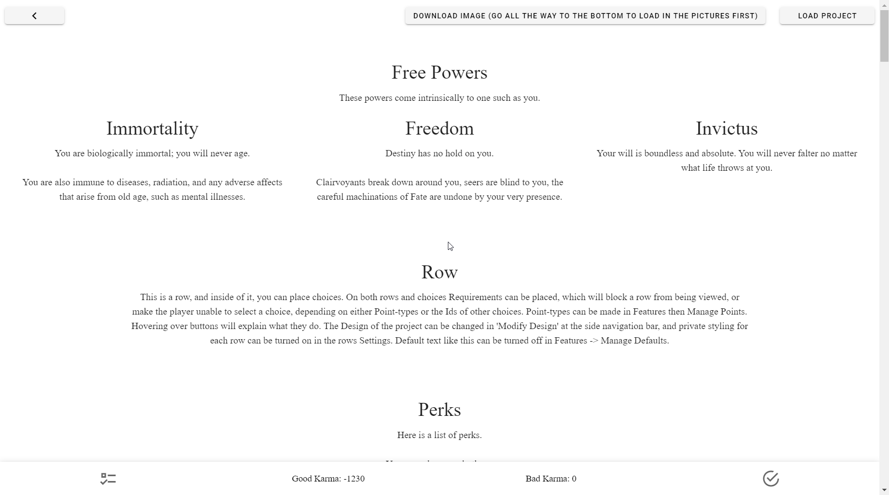
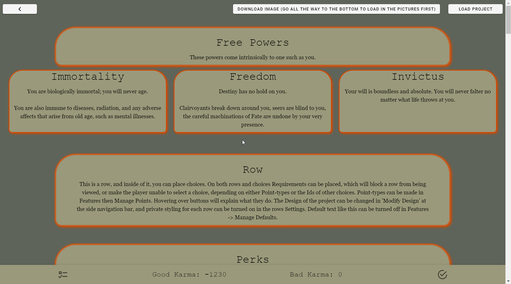
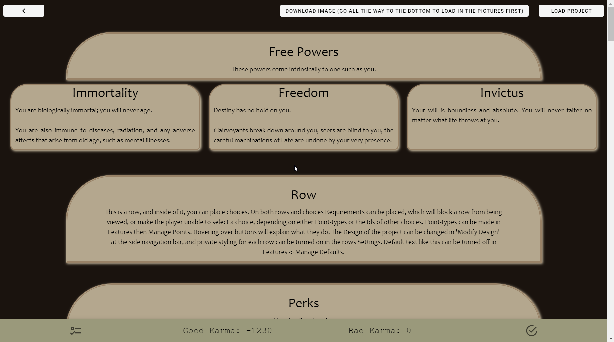
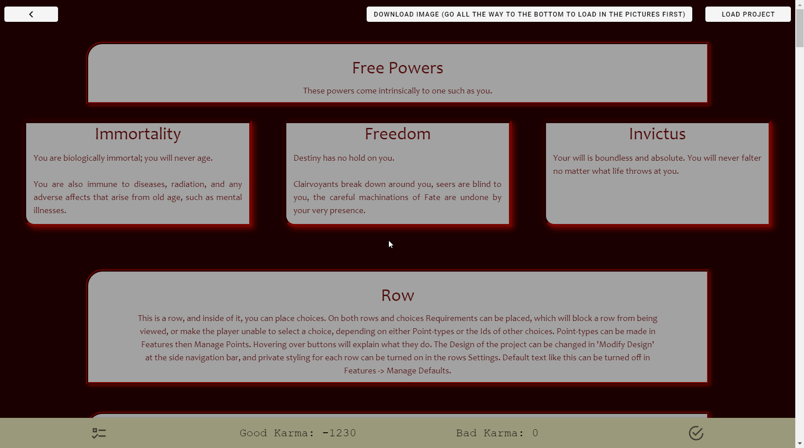

# Style Templates
Style Templates are in-built templates to give you a design to start off with.

!!! tip

    While some styling is better than none, it is not recommended you take
    **any** of the default Style Templates (at least, as they are), if having a
    pleasing appearance is a concern. To some, they may just wish a functional
    Interactive and that's it, which is completely fine. Otherwise, the styling
    on the templates aren't very good.

## Adding a Style Template
To add a Style Template, simply go into **the Sidebar** → **Open Features** →
**Style Templates**.

You will be presented with 8 options:
<!-- make this multiple columns -->

* [Fall](#fall)
* [Book](#book)
* [Bone](#bone)
* [Dark](#dark)
* [Hello 2021](#hello-2021)
* [Black and Gold](#black-and-gold)
* [Rainbow](#rainbow)
* [Seeing Greens](#seeing-greens)

## Style Templates
These are the eight Style Templates:

=== "None"

    

=== "Fall"

    

=== "Book"

    

=== "Bone"

    

=== "Dark"

    

=== "Hello 2021"

    

    !!! warning

        This one is especially bad in terms of contrast.

=== "Black and Gold"

    

=== "Rainbow"

    

    !!! warning

        Another bad one.

=== "Seeing Green"

    

### None
This is the default style.

### Fall

### Book

### Bone

### Dark

### Hello 2021

### Black and Gold

### Rainbow

### Seeing Greens
